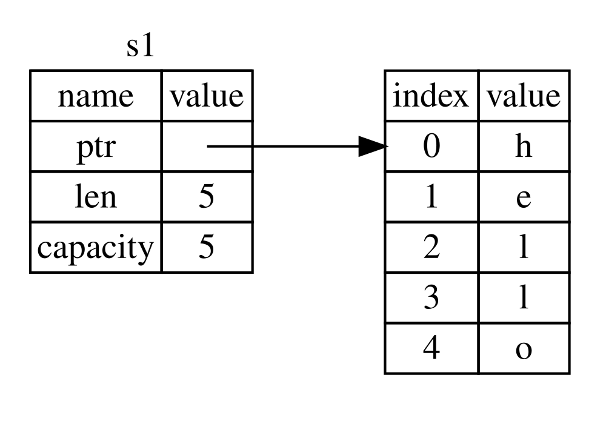
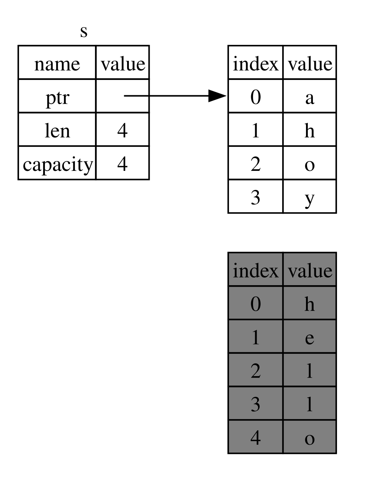

## What Is Ownership?

*Ownership* rules ka ek set hai jo ye govern karta hai ke Rust program memory ko kaise manage karta hai. Tamam programs ko ye manage karna hota hai ke run hote waqt woh computer ki memory ko kis tarah use karte hain. Kuch languages mein garbage collection hoti hai jo program run hone ke dauran regularly aisi memory ko dhoondti hai jo ab use nahi ho rahi hoti; doosri languages mein programmer ko memory ko explicitly allocate aur free karna padta hai. Rust teesra approach use karta hai: Memory ko ownership ke ek system ke zariye manage kiya jata hai jisme rules ka ek set hota hai jinhein compiler check karta hai. Agar in mein se koi bhi rule violate ho, to program compile nahi hoga. Ownership ki koi bhi feature aapke program ko run hote waqt slow nahi karegi.

Kyun ke ownership bohat se programmers ke liye ek naya concept hai, is liye ise samajhne aur iska aadhi hone mein kuch waqt lagta hai. Achhi baat ye hai ke jaise jaise aap Rust aur ownership system ke rules ke saath zyada experienced hote jayenge, aapke liye naturally aisa code develop karna aasaan hota jayega jo safe aur efficient ho. Laga rehne dein!

Jab aap ownership ko samajh lenge, to aapke paas un features ko samajhne ke liye ek solid foundation hoga jo Rust ko unique banate hain. Is chapter mein, aap kuch examples ke zariye ownership seekhenge jo ek bohat common data structure: strings, par focus karte hain.

> ### The Stack and the Heap
>
> Bohat si programming languages mein aapko stack aur heap ke baare mein bohat zyada sochne ki zaroorat nahi padti. Lekin Rust jaisi systems programming language mein, koi value stack par hai ya heap par, is baat ka asar is par padta hai ke language kaise behave karti hai aur aapko kuch khaas decisions kyun lene padte hain. Ownership ke kuch parts ko baad mein is chapter mein stack aur heap ke hawale se describe kiya jayega, is liye tayyari ke taur par yahan ek mukhtasar explanation di ja rahi hai.
>
> Stack aur heap dono memory ke woh hisse hain jo runtime par aapke code ke use ke liye available hote hain, lekin dono mukhtalif tareeqon se structured hote hain. Stack values ko us order mein store karta hai jis order mein woh usay milti hain aur values ko us ke ulat order mein remove karta hai. Isay *last in, first out (LIFO)* kaha jata hai. Plates ke ek stack ka tasawwur karein: Jab aap mazeed plates add karte hain, to unhein pile ke upar rakhte hain, aur jab aapko ek plate chahiye hoti hai, to aap upar se ek plate uthate hain. Darmiyan ya neeche se plates add ya remove karna itna effective nahi hoga! Data add karne ko *pushing onto the stack* kaha jata hai, aur data remove karne ko *popping off the stack* kaha jata hai. Stack par store hone wale tamam data ka size known aur fixed hona zaroori hai. Aisa data jis ka size compile time par unknown ho ya jis ka size change ho sakta ho, usay is ke bajaye heap par store karna zaroori hai.
>
> Heap kam organized hota hai: Jab aap heap par data rakhte hain, to aap ek khaas amount of space request karte hain. Memory allocator heap mein ek aisi khaali jagah dhoondta hai jo kaafi badi ho, use in use mark karta hai, aur ek *pointer* return karta hai, jo us location ka address hota hai. Is process ko *allocating on the heap* kaha jata hai aur kabhi kabhi sirf *allocating* keh kar mukhtasar kiya jata hai (values ko stack par push karna allocating nahi mana jata). Kyun ke heap ka pointer ek known, fixed size rakhta hai, aap pointer ko stack par store kar sakte hain, lekin jab aap actual data chahte hain, to aapko pointer ko follow karna hota hai. Kisi restaurant mein baithe hone ka tasawwur karein. Jab aap enter karte hain, to aap apne group mein logon ki tadaad batate hain, aur host ek aisi khaali table dhoondta hai jo sab ke liye munasib ho aur aapko wahan le jata hai. Agar aapke group mein se koi der se aaye, to woh pooch sakta hai ke aap kahan baithe hain taa-ke woh aapko dhoond sake.
>
> Stack par push karna heap par allocate karne se zyada fast hota hai kyun ke allocator ko new data store karne ke liye koi jagah search nahi karni padti; woh location hamesha stack ke top par hoti hai. Is ke muqable mein, heap par space allocate karne mein zyada kaam hota hai kyun ke allocator ko pehle data rakhne ke liye kaafi badi space dhoondni hoti hai aur phir next allocation ke liye tayari karne ke liye bookkeeping karni hoti hai.
>
> Heap mein data access karna aam tor par stack par data access karne se slow hota hai kyun ke wahan tak pohanchne ke liye aapko ek pointer follow karna padta hai. Contemporary processors us waqt zyada fast hote hain jab unhein memory mein kam idhar-udhar jump karna pade. Isi analogy ko aage barhate hue, ek restaurant mein kai tables se orders lene wale server ka tasawwur karein. Sab se efficient ye hai ke ek table ke tamam orders lene ke baad agli table ki taraf jaya jaye. Table A se ek order lena, phir table B se ek order lena, phir dobara A se aur phir dobara B se order lena kaafi slow process hoga. Isi tarah, processor aam tor par apna kaam behtar tareeqe se kar sakta hai agar woh aise data par kaam kare jo doosre data ke qareeb ho (jaise stack par hota hai) bajaye is ke ke woh data door ho (jaise heap par ho sakta hai).
>
> Jab aapka code kisi function ko call karta hai, to function mein pass ki jane wali values (jin mein, mumkin hai, heap par data ke pointers bhi shamil hon) aur function ke local variables stack par push ho jate hain. Jab function khatam hota hai, to woh values stack se pop ho jati hain.
>
> Ye track rakhna ke code ke kaun se parts heap par mojood kis data ko use kar rahe hain, heap par duplicate data ki amount ko minimum rakhna, aur heap par unused data ko clean up karna taa-ke aapke paas space khatam na ho jaye, ye sab woh problems hain jinhein ownership address karti hai. Jab aap ownership ko samajh lenge, to aapko stack aur heap ke baare mein bohat zyada sochne ki zaroorat nahi padegi. Lekin ye jaanna ke ownership ka main purpose heap data ko manage karna hai, ye samajhne mein madad kar sakta hai ke ownership jis tarah kaam karti hai, us tarah kyun karti hai.


### Ownership Rules

Sab se pehle, aaiye ownership ke rules par nazar daalte hain. In rules ko zehan mein rakhein jab hum un examples ke zariye kaam karenge jo inhein illustrate karte hain:

* Rust mein har value ka ek *owner* hota hai.
* Ek waqt mein sirf ek owner ho sakta hai.
* Jab owner scope se bahar chala jata hai, to value drop kar di jati hai.

### Variable Scope

Ab jab hum basic Rust syntax se aage nikal chuke hain, hum examples mein tamam `fn main() {` code include nahi karenge, is liye agar aap hamare saath follow kar rahe hain, to ye ensure karein ke following examples ko manually ek `main` function ke andar rakhein. Is ka result ye hai ke hamare examples thore zyada concise honge, aur humein boilerplate code ke bajaye asal details par focus karne ka mauqa milega.

Ownership ki pehli example ke taur par, hum kuch variables ke scope ko dekhenge. Ek *scope* program ke andar woh range hai jahan tak koi item valid hota hai. Following variable ko dekhein:

```rust
let s = "hello";
```

Variable `s` ek string literal ko refer karta hai, jahan string ki value hamare program ke text mein hardcoded hoti hai. Variable us point se valid hota hai jahan use declare kiya jata hai aur current scope ke end tak valid rehta hai. Listing 4-1 ek aisa program dikhati hai jisme comments ke zariye annotate kiya gaya hai ke variable `s` kahan valid hoga.

<Listing number="4-1" caption="Ek variable aur woh scope jisme ye valid hota hai">

```rust
{{#rustdoc_include ../listings/ch04-understanding-ownership/listing-04-01/src/main.rs:here}}
```

</Listing>

Doosre alfaaz mein, yahan waqt ke do important points hain:

* Jab `s` scope mein *aata* hai, to ye valid hota hai.
* Ye tab tak valid rehta hai jab tak ye scope se *bahar* nahi chala jata.

Is point par, scopes aur variables ke valid hone ke darmiyan relationship doosri programming languages ke jaisa hi hai. Ab hum is understanding ko aage barhate hue `String` type introduce karenge.


### The `String` Type

Ownership ke rules ko illustrate karne ke liye, humein ek aisi data type ki zaroorat hai jo un types se zyada complex ho jinhein hum ne Chapter 3 ke [“Data Types”][data-types]<!-- ignore --> section mein cover kiya tha. Pehle cover ki gayi types ka size known hota hai, unhein stack par store kiya ja sakta hai aur jab unka scope khatam ho jaye to stack se pop kiya ja sakta hai, aur agar code ke kisi doosre part ko kisi different scope mein wohi value use karni ho to unhein quickly aur trivially copy karke ek naya, independent instance banaya ja sakta hai. Lekin hum us data ko dekhna chahte hain jo heap par store hota hai aur ye explore karna chahte hain ke Rust kaise jaanta hai ke us data ko kab clean up karna hai, aur `String` type is ki ek behtareen example hai.

Hum `String` ke un parts par focus karenge jo ownership se related hain. Ye aspects doosri complex data types par bhi apply hote hain, chahe woh standard library ki taraf se provide ki gayi hon ya aap ne khud create ki hon. `String` ke non-ownership aspects par hum [Chapter 8][ch8]<!-- ignore --> mein baat karenge.

Hum string literals ko pehle hi dekh chuke hain, jahan string ki value hamare program mein hardcoded hoti hai. String literals convenient hoti hain, lekin har us situation ke liye suitable nahi hoti jahan hum text use karna chahte hon. Ek wajah ye hai ke woh immutable hoti hain. Doosri wajah ye hai ke har string value ko us waqt know nahi kiya ja sakta jab hum apna code likh rahe hote hain: Misal ke taur par, agar hum user input lena aur use store karna chahein to? Inhi situations ke liye Rust mein `String` type mojood hai. Ye type heap par allocate kiye gaye data ko manage karti hai aur is tarah aise amount of text ko store kar sakti hai jo compile time par hamare liye unknown ho. Aap `from` function ko use karke ek string literal se `String` create kar sakte hain, is tarah:

```rust
let s = String::from("hello");
```

Double colon `::` operator humein is particular `from` function ko `String` type ke under namespace karne deta hai, bajaye is ke ke `string_from` jaisa koi name use kiya jaye. Hum is syntax par [“Methods”][methods]<!--
ignore --> section of Chapter 5 mein mazeed baat karenge, aur Chapter 7 mein modules ke saath namespacing par [“Paths for Referring to an Item in the Module
Tree”][paths-module-tree]<!-- ignore --> mein baat karenge.

Is qisam ki string ko *mutate* kiya ja sakta hai:

```rust
{{#rustdoc_include ../listings/ch04-understanding-ownership/no-listing-01-can-mutate-string/src/main.rs:here}}
```

To phir yahan difference kya hai? `String` ko mutate kyun kiya ja sakta hai lekin literals ko nahi? Difference is baat mein hai ke ye dono types memory ke saath kis tarah deal karti hain.


### Memory and Allocation

String literal ke case mein, hum compile time par contents jaante hain, is liye text ko final executable mein directly hardcode kar diya jata hai. Isi wajah se string literals fast aur efficient hoti hain. Lekin ye properties sirf string literal ki immutability ki wajah se hoti hain. Badqismati se, hum har us text ke liye binary mein memory ka ek bara block nahi rakh sakte jis ka size compile time par unknown ho aur jo program run hone ke dauran change bhi ho sakta ho.

`String` type ke saath, mutable aur growable text ko support karne ke liye humein heap par ek aisi amount of memory allocate karni hoti hai jo compile time par unknown hoti hai, taa-ke us mein contents ko hold kiya ja sake. Is ka matlab hai:

* Memory ko runtime par memory allocator se request karna zaroori hai.
* Jab hum apni `String` ke saath kaam kar chuke hon, to humein is memory ko allocator ko wapas karne ka ek tareeqa chahiye.

Pehla hissa hum khud karte hain: Jab hum `String::from` call karte hain, to iski implementation apni zaroorat ke mutabiq memory request karti hai. Programming languages mein ye lagbhag universal hai.

Lekin doosra hissa different hai. *Garbage collector (GC)* wali languages mein, GC us memory ko track aur clean up karta hai jo ab use nahi ho rahi hoti, aur humein is ke baare mein sochne ki zaroorat nahi padti. Zyada tar un languages mein jin mein GC nahi hoti, ye hamari responsibility hoti hai ke hum identify karein ke memory kab use hona band ho gayi hai aur use explicitly free karne ke liye code call karein, bilkul usi tarah jaise hum ne use request karne ke liye kiya tha. Isay sahi tareeqe se karna historically ek mushkil programming problem raha hai. Agar hum bhool jayein, to memory waste hogi. Agar hum ise bohat jaldi kar dein, to hamare paas ek invalid variable hoga. Agar hum ise do baar karein, to woh bhi ek bug hai. Humein exactly ek `allocate` ko exactly ek `free` ke saath pair karna hota hai.

Rust ek different raasta choose karta hai: Jab us variable ka scope khatam ho jata hai jo memory ka owner hai, to memory automatically return kar di jati hai. Yahan Listing 4-1 ke hamare scope example ka ek version hai jo string literal ke bajaye `String` use karta hai:

```rust
{{#rustdoc_include ../listings/ch04-understanding-ownership/no-listing-02-string-scope/src/main.rs:here}}
```

Ek natural point mojood hai jahan hum apni `String` ko required memory allocator ko wapas kar sakte hain: jab `s` scope se bahar chala jata hai. Jab koi variable scope se bahar jata hai, Rust hamare liye ek special function call karta hai. Is function ko `drop` kaha jata hai, aur yahin `String` ka author memory ko wapas karne wala code rakh sakta hai. Rust closing curly bracket par automatically `drop` call karta hai.

> Note: C++ mein, kisi item ki lifetime ke end par resources ko deallocate karne ke is pattern ko kabhi kabhi *Resource Acquisition Is Initialization (RAII)* kaha jata hai. Agar aap ne RAII patterns use kiye hain, to Rust ka `drop` function aapko familiar lagega.

Is pattern ka Rust code likhne ke tareeqe par gehra asar hai. Filhaal ye simple lag sakta hai, lekin zyada complicated situations mein, jab hum multiple variables ko heap par allocate kiye gaye data ko use karwana chahte hain, to code ka behavior unexpected ho sakta hai. Aaiye ab in mein se kuch situations ko explore karte hain.

<!-- Old headings. Do not remove or links may break. -->

<a id="ways-variables-and-data-interact-move"></a>


#### Variables and Data Interacting with Move

Rust mein multiple variables ek hi data ke saath mukhtalif tareeqon se interact kar sakte hain. Listing 4-2 integer ko use karte hue ek example dikhati hai.

<Listing number="4-2" caption="Variable `x` ki integer value ko `y` ko assign karna">

```rust
{{#rustdoc_include ../listings/ch04-understanding-ownership/listing-04-02/src/main.rs:here}}
```

</Listing>

Hum shayad andaza laga sakte hain ke ye kya kar raha hai: “Value `5` ko `x` ke saath bind karo; phir `x` ki value ki ek copy banao aur use `y` ke saath bind karo.” Ab hamare paas do variables, `x` aur `y`, hain aur dono `5` ke barabar hain. Waqai yahi ho raha hai, kyun ke integers simple values hain jin ka size known aur fixed hota hai, aur ye dono `5` values stack par push ki jati hain.

Ab `String` version ko dekhte hain:

```rust
{{#rustdoc_include ../listings/ch04-understanding-ownership/no-listing-03-string-move/src/main.rs:here}}
```

Ye bohat similar lagta hai, is liye hum assume kar sakte hain ke ye bhi usi tarah kaam karega: Yani, doosri line `s1` mein mojood value ki ek copy banayegi aur use `s2` ke saath bind kar degi. Lekin asal mein aisa poori tarah nahi hota.

Figure 4-1 ko dekhein taa-ke samajh saken ke `String` ke under the covers kya ho raha hai. Ek `String` teen parts par mushtamil hoti hai, jo left par dikhaye gaye hain: memory ka ek pointer jo string ke contents ko hold karti hai, ek length, aur ek capacity. Ye data ka group stack par store hota hai. Right par heap ki woh memory hai jo contents ko hold karti hai.



<span class="caption">Figure 4-1: Memory mein ek `String` ki representation jo `"hello"` value ko `s1` ke saath bound hone ki surat mein dikhati hai</span>

Length se murad hai ke `String` ke contents filhaal kitni memory, bytes mein, use kar rahe hain. Capacity se murad hai ke `String` ne allocator se total kitni memory, bytes mein, receive ki hai. Length aur capacity ke darmiyan difference important hai, lekin is context mein nahi, is liye filhaal capacity ko ignore karna theek hai.

Jab hum `s1` ko `s2` assign karte hain, to `String` data copy hota hai, yani hum stack par mojood pointer, length, aur capacity ko copy karte hain. Hum heap par mojood us data ko copy nahi karte jis ki taraf pointer refer karta hai. Doosre alfaaz mein, memory mein data ki representation Figure 4-2 jaisi nazar aati hai.


<span class="caption">Figure 4-2: Variable `s2` ki memory mein representation, jisme `s1` ke pointer, length, aur capacity ki copy mojood hai</span>

Representation Figure 4-3 jaisi *nahi* hoti, jo us waqt memory ki surat-e-haal hoti agar Rust heap data ko bhi copy karta. Agar Rust aisa karta, to operation `s2 = s1` runtime performance ke hawale se bohat mehnga ho sakta tha agar heap par data bohat bara hota.


<span class="caption">Figure 4-3: Agar Rust heap data ko bhi copy karta to `s2 = s1` kya kar sakta tha, is ki ek aur mumkin representation</span>

Hum ne pehle kaha tha ke jab koi variable scope se bahar jata hai, Rust automatically `drop` function call karta hai aur us variable ke liye heap memory ko clean up karta hai. Lekin Figure 4-2 mein dono data pointers ek hi location ki taraf point kar rahe hain. Ye ek problem hai: Jab `s2` aur `s1` scope se bahar jayenge, to dono same memory ko free karne ki koshish karenge. Isay *double free* error kaha jata hai aur ye un memory safety bugs mein se ek hai jin ka hum ne pehle zikr kiya tha. Memory ko do baar free karna memory corruption ka sabab ban sakta hai, jo potentially security vulnerabilities tak le ja sakta hai.

Memory safety ensure karne ke liye, line `let s2 = s1;` ke baad Rust `s1` ko no longer valid samajhta hai. Is liye, jab `s1` scope se bahar jata hai to Rust ko kuch bhi free karne ki zaroorat nahi hoti. Dekhein ke jab `s2` create hone ke baad aap `s1` ko use karne ki koshish karte hain to kya hota hai; ye kaam nahi karega:

```rust,ignore,does_not_compile
{{#rustdoc_include ../listings/ch04-understanding-ownership/no-listing-04-cant-use-after-move/src/main.rs:here}}
```

Aapko is tarah ka error milega kyun ke Rust aapko invalidated reference ko use karne se rokta hai:

```console
{{#include ../listings/ch04-understanding-ownership/no-listing-04-cant-use-after-move/output.txt}}
```

Agar aap ne doosri languages ke saath kaam karte hue *shallow copy* aur *deep copy* ki terms suni hain, to data ko copy kiye baghair pointer, length, aur capacity ko copy karne ka concept shayad aapko shallow copy jaisa lage. Lekin kyun ke Rust pehle variable ko bhi invalid kar deta hai, is liye ise shallow copy kehne ke bajaye *move* kaha jata hai. Is example mein hum kahenge ke `s1` ko `s2` mein *moved* kiya gaya. To asal mein jo hota hai woh Figure 4-4 mein dikhaya gaya hai.


<span class="caption">Figure 4-4: `s1` ke invalidated hone ke baad memory mein representation</span>

Ye hamari problem solve kar deta hai! Sirf `s2` valid hone ki wajah se, jab ye scope se bahar jayega to sirf ye memory ko free karega, aur hamara kaam khatam.

Is ke ilawa, is mein ek design choice bhi implied hai: Rust aapke data ki “deep” copies kabhi automatically create nahi karega. Is liye, kisi bhi *automatic* copying ke baare mein ye assume kiya ja sakta hai ke runtime performance ke hawale se woh inexpensive hai.


#### Scope and Assignment

Scoping, ownership, aur `drop` function ke zariye memory free hone ke darmiyan relationship ka ulta bhi true hai. Jab aap kisi existing variable ko ek bilkul nayi value assign karte hain, to Rust `drop` call karega aur original value ki memory ko foran free kar dega. Misal ke taur par, is code ko dekhein:

```rust
{{#rustdoc_include ../listings/ch04-understanding-ownership/no-listing-04b-replacement-drop/src/main.rs:here}}
```

Shuru mein hum ek variable `s` declare karte hain aur use `"hello"` value wali ek `String` ke saath bind karte hain. Phir hum foran `"ahoy"` value wali ek nayi `String` create karte hain aur use `s` ko assign kar dete hain. Is point par heap par mojood original value ko refer karne wala koi bhi nahi hai. Figure 4-5 stack aur heap ke data ko is waqt dikhati hai:



<span class="caption">Figure 4-5: Jab initial value ko mukammal taur par replace kar diya gaya ho to memory mein representation</span>

Is tarah original string foran scope se bahar chali jati hai. Rust us par `drop` function run karega aur uski memory foran free kar di jayegi. Jab hum aakhir mein value print karte hain, to woh `"ahoy, world!"` hogi.

<!-- Old headings. Do not remove or links may break. -->

<a id="ways-variables-and-data-interact-clone"></a>


#### Variables and Data Interacting with Clone

Agar hum `String` ke heap data ko *deeply copy* karna chahte hain, sirf stack data ko nahi, to hum `clone` naam ke ek common method ko use kar sakte hain. Hum Chapter 5 mein method syntax par baat karenge, lekin kyun ke methods bohat si programming languages mein common feature hain, mumkin hai ke aap ne inhein pehle dekha ho.

Yahan `clone` method ko action mein dekhne ki ek example hai:

```rust
{{#rustdoc_include ../listings/ch04-understanding-ownership/no-listing-05-clone/src/main.rs:here}}
```

Ye bilkul theek kaam karta hai aur explicitly Figure 4-3 mein dikhaye gaye behavior ko produce karta hai, jahan heap data *waqai* copy hota hai.

Jab aap `clone` ki call dekhte hain, to aap jaante hain ke kuch arbitrary code execute ho raha hai aur ye code expensive ho sakta hai. Ye ek visual indicator hai ke kuch different ho raha hai.


#### Stack-Only Data: Copy

Ek aur pehlu hai jis par hum ne abhi tak baat nahi ki. Integers ko use karne wala ye code—jis ka ek hissa Listing 4-2 mein dikhaya gaya tha—kaam karta hai aur valid hai:

```rust
{{#rustdoc_include ../listings/ch04-understanding-ownership/no-listing-06-copy/src/main.rs:here}}
```

Lekin ye code us baat se contradict karta hua lagta hai jo hum ne abhi seekhi: Humare paas `clone` ki koi call nahi hai, lekin `x` phir bhi valid hai aur `y` mein move nahi hua.

Is ki wajah ye hai ke integers jaisi types, jin ka size compile time par known hota hai, poori tarah stack par store hoti hain, is liye actual values ki copies banana fast hota hai. Is ka matlab hai ke `y` variable create karne ke baad `x` ko valid rakhne se rokne ki koi wajah nahi hai. Doosre alfaaz mein, yahan deep aur shallow copying ke darmiyan koi difference nahi hai, is liye `clone` call karne se usual shallow copying se different kuch nahi hoga aur hum ise chhor sakte hain.

Rust mein ek special annotation hoti hai jise `Copy` trait kaha jata hai, jo hum un types par laga sakte hain jo stack par store hoti hain, jaise integers (hum [Chapter 10][traits]<!-- ignore --> mein traits ke baare mein mazeed baat karenge). Agar koi type `Copy` trait implement karti hai, to usay use karne wale variables move nahi hote, balki trivially copy ho jate hain, jis ki wajah se kisi doosre variable ko assign kiye jane ke baad bhi woh valid rehte hain.

Rust humein kisi type ko `Copy` se annotate karne ki ijazat nahi deta agar woh type, ya us ka koi bhi part, `Drop` trait implement karta ho. Agar value ke scope se bahar jane par type ko kuch special karna zaroori ho aur hum us type mein `Copy` annotation add kar dein, to humein compile-time error milega. Apni type mein trait implement karne ke liye `Copy` annotation add karne ka tareeqa jaanne ke liye Appendix C mein [“Derivable
Traits”][derivable-traits]<!-- ignore --> dekhein.

To phir kaun si types `Copy` trait implement karti hain? Yaqeen karne ke liye aap di gayi type ki documentation check kar sakte hain, lekin ek general rule ke taur par, simple scalar values ka koi bhi group `Copy` implement kar sakta hai, aur koi bhi aisi cheez jo allocation require karti ho ya kisi qisam ka resource ho, `Copy` implement nahi kar sakti. Yahan kuch aisi types hain jo `Copy` implement karti hain:

* Tamam integer types, jaise `u32`.
* Boolean type, `bool`, jis ki values `true` aur `false` hain.
* Tamam floating-point types, jaise `f64`.
* Character type, `char`.
* Tuples, agar un mein sirf aisi types shamil hon jo khud bhi `Copy` implement karti hain. Misal ke taur par, `(i32, i32)` `Copy` implement karta hai, lekin `(i32, String)` nahi karta.


### Ownership and Functions

Kisi value ko function mein pass karne ka mechanism us waqt ke mechanism jaisa hai jab kisi value ko variable ke saath assign kiya jata hai. Kisi variable ko function mein pass karna bhi assignment ki tarah usay move ya copy karega. Listing 4-3 mein kuch annotations ke saath ek example diya gaya hai jo dikhata hai ke variables kahan scope mein aate hain aur kahan scope se bahar jate hain.

<Listing number="4-3" file-name="src/main.rs" caption="Ownership aur scope ke saath annotated functions">

```rust
{{#rustdoc_include ../listings/ch04-understanding-ownership/listing-04-03/src/main.rs}}
```

</Listing>

Agar hum `takes_ownership` ki call ke baad `s` ko use karne ki koshish karein, to Rust compile-time error throw karega. Ye static checks humein mistakes se protect karte hain. `main` mein aisa code add karke dekhein jo `s` aur `x` ko use karta ho, taa-ke aap dekh saken ke aap inhein kahan use kar sakte hain aur ownership rules aapko kahan aisa karne se rokte hain.


### Return Values and Scope

Values return karna bhi ownership transfer kar sakta hai. Listing 4-4 ek aise function ki example dikhati hai jo kuch value return karta hai, aur is mein Listing 4-3 jaisi annotations use ki gayi hain.

<Listing number="4-4" file-name="src/main.rs" caption="Return values ki ownership transfer karna">

```rust
{{#rustdoc_include ../listings/ch04-understanding-ownership/listing-04-04/src/main.rs}}
```

</Listing>

Har baar variable ki ownership isi pattern ko follow karti hai: Kisi value ko kisi doosre variable ke saath assign karne se woh move ho jati hai. Jab heap par data rakhne wala koi variable scope se bahar chala jata hai, to value ko `drop` ke zariye clean up kar diya jata hai, jab tak ke data ki ownership kisi doosre variable ko move na ho gayi ho.

Halanke ye kaam karta hai, har function ke saath ownership lena aur phir ownership return karna thora tedious hai. Agar hum chahte hon ke koi function kisi value ko use kare lekin uski ownership na le, to kya karein? Ye kaafi annoying hai ke jo bhi cheez hum function mein pass karein, agar humein use dobara use karna ho to function se milne wale kisi bhi resultant data ke ilawa use bhi wapas pass karna pade, agar hum use return karna chahte hon.

Rust humein tuple ko use karke multiple values return karne deta hai, jaisa ke Listing 4-5 mein dikhaya gaya hai.

<Listing number="4-5" file-name="src/main.rs" caption="Parameters ki ownership return karna">

```rust
{{#rustdoc_include ../listings/ch04-understanding-ownership/listing-04-05/src/main.rs}}
```

</Listing>

Lekin ye us concept ke liye bohat zyada ceremony aur kaafi kaam hai jo common hona chahiye. Khush qismati se, Rust ke paas ownership transfer kiye baghair kisi value ko use karne ka ek feature hai: references.

[data-types]: ch03-02-data-types.html#data-types
[ch8]: ch08-02-strings.html
[traits]: ch10-02-traits.html
[derivable-traits]: appendix-03-derivable-traits.html
[methods]: ch05-03-method-syntax.html#methods
[paths-module-tree]: ch07-03-paths-for-referring-to-an-item-in-the-module-tree.html

