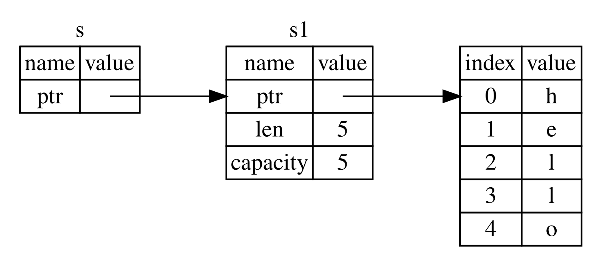

## References and Borrowing

Listing 4-5 mein tuple code ka masla ye hai ke humein `String` ko calling function ko return karna padta hai taa-ke `calculate_length` ki call ke baad bhi hum `String` ko use kar saken, kyun ke `String` ko `calculate_length` mein move kar diya gaya tha. Is ke bajaye, hum `String` value ka ek reference provide kar sakte hain. Reference ek pointer ki tarah hota hai, yani ye ek aisa address hota hai jise follow karke hum us address par stored data tak access kar sakte hain; woh data kisi doosre variable ki ownership mein hota hai. Pointer ke unlike, reference ke baare mein guarantee hoti hai ke reference ki lifetime ke dauran woh kisi particular type ki valid value ki taraf point karega.

Yahan bataya gaya hai ke aap `calculate_length` function ko kaise define aur use karenge, jisme value ki ownership lene ke bajaye object ka reference parameter ke taur par diya gaya hai:

<Listing file-name="src/main.rs">

```rust
{{#rustdoc_include ../listings/ch04-understanding-ownership/no-listing-07-reference/src/main.rs:all}}
```

</Listing>

Sab se pehle, notice karein ke variable declaration aur function return value mein tuple ka tamam code khatam ho gaya hai. Doosri baat, note karein ke hum `calculate_length` mein `&s1` pass karte hain aur iski definition mein `String` ke bajaye `&String` lete hain. Ye ampersands references ko represent karte hain, aur ye aapko kisi value ki ownership liye baghair usay refer karne dete hain. Figure 4-6 is concept ko depict karti hai.



<span class="caption">Figure 4-6: `&String` `s` ka `String` `s1` ki taraf point karne ka diagram</span>

> Note: `&` ko use karke referencing ka opposite *dereferencing* hai, jo dereference operator, `*`, ke zariye ki jati hai. Hum Chapter 8 mein dereference operator ke kuch uses dekhenge aur Chapter 15 mein dereferencing ki details par baat karenge.

Aaiye yahan function call ko thora aur qareeb se dekhte hain:

```rust
{{#rustdoc_include ../listings/ch04-understanding-ownership/no-listing-07-reference/src/main.rs:here}}
```

`&s1` syntax humein ek aisa reference create karne deta hai jo `s1` ki value ko *refer* karta hai, lekin uski ownership nahi rakhta. Kyun ke reference ki ownership nahi hoti, is liye jis value ki taraf ye point karta hai, reference ka use khatam hone par woh drop nahi hoti.

Isi tarah, function ki signature mein `&` indicate karta hai ke parameter `s` ki type ek reference hai. Aaiye kuch explanatory annotations add karte hain:

```rust
{{#rustdoc_include ../listings/ch04-understanding-ownership/no-listing-08-reference-with-annotations/src/main.rs:here}}
```

Jis scope mein variable `s` valid hai, woh kisi bhi function parameter ke scope jaisa hi hai, lekin reference jis value ki taraf point karta hai woh `s` ka use khatam hone par drop nahi hoti, kyun ke `s` ke paas ownership nahi hai. Jab functions actual values ke bajaye references ko parameters ke taur par use karte hain, to ownership wapas dene ke liye humein values ko return karne ki zaroorat nahi hoti, kyun ke hamare paas kabhi ownership thi hi nahi.

Reference create karne ke action ko hum *borrowing* kehte hain. Real life ki tarah, agar kisi person ke paas koi cheez owned ho, to aap us se woh cheez borrow kar sakte hain. Jab aapka kaam khatam ho jaye, to aapko woh wapas deni hoti hai. Woh cheez aapki ownership mein nahi hoti.

To phir kya hota hai agar hum kisi aisi cheez ko modify karne ki koshish karein jise hum borrow kar rahe hain? Listing 4-6 ka code try karein. Spoiler alert: Ye kaam nahi karta!

<Listing number="4-6" file-name="src/main.rs" caption="Borrowed value ko modify karne ki koshish">

```rust,ignore,does_not_compile
{{#rustdoc_include ../listings/ch04-understanding-ownership/listing-04-06/src/main.rs}}
```

</Listing>

Yahan error hai:

```console
{{#include ../listings/ch04-understanding-ownership/listing-04-06/output.txt}}
```

Jis tarah variables by default immutable hote hain, isi tarah references bhi by default immutable hote hain. Humein us cheez ko modify karne ki ijazat nahi hoti jis ka hamare paas reference ho.

### Mutable References

Hum Listing 4-6 ke code ko kuch chhoti si tabdeeliyon ke zariye theek kar sakte hain taa-ke humein borrowed value ko modify karne ki ijazat mil jaye. Is ke liye hum *mutable reference* use karenge:

<Listing file-name="src/main.rs">

```rust
{{#rustdoc_include ../listings/ch04-understanding-ownership/no-listing-09-fixes-listing-04-06/src/main.rs}}
```

</Listing>

Sab se pehle, hum `s` ko `mut` kar dete hain. Phir, jahan hum `change` function ko call karte hain wahan `&mut s` ke zariye ek mutable reference create karte hain aur function signature ko update karte hain taa-ke woh mutable reference accept kare, `some_string: &mut String`. Is se ye bohat clear ho jata hai ke `change` function us value ko mutate karega jise woh borrow karta hai.

Mutable references par ek bari restriction hai: Agar aapke paas kisi value ka mutable reference hai, to aapke paas usi value ke koi aur references nahi ho sakte. Ye code jo `s` ke do mutable references create karne ki koshish karta hai, fail ho jayega:

<Listing file-name="src/main.rs">

```rust,ignore,does_not_compile
{{#rustdoc_include ../listings/ch04-understanding-ownership/no-listing-10-multiple-mut-not-allowed/src/main.rs:here}}
```

</Listing>

Yahan error hai:

```console
{{#include ../listings/ch04-understanding-ownership/no-listing-10-multiple-mut-not-allowed/output.txt}}
```

Ye error kehta hai ke ye code invalid hai kyun ke hum `s` ko ek waqt mein ek se zyada baar mutable borrow nahi kar sakte. Pehla mutable borrow `r1` mein hai aur ye us waqt tak rehna zaroori hai jab tak ise `println!` mein use nahi kar liya jata, lekin is mutable reference ko create karne aur use karne ke darmiyan hum ne `r2` mein ek aur mutable reference create karne ki koshish ki jo `r1` ke same data ko borrow karta hai.

Ek hi waqt mein same data ke multiple mutable references ko prevent karne wali ye restriction mutation ki ijazat deti hai, lekin bohat controlled tareeqe se. Ye ek aisi cheez hai jis ke saath naye Rustaceans struggle karte hain kyun ke zyada tar languages aapko jab chahein mutation karne deti hain. Is restriction ka faida ye hai ke Rust compile time par data races ko prevent kar sakta hai. Ek *data race* race condition jaisi hoti hai aur us waqt hoti hai jab ye teen behaviors occur karein:

* Do ya do se zyada pointers ek hi waqt mein same data ko access kar rahe hon.
* Kam az kam ek pointer data ko write karne ke liye use ho raha ho.
* Data tak access ko synchronize karne ke liye koi mechanism use na ho raha ho.

Data races undefined behavior ka sabab banti hain aur runtime par unhein track down karne ki koshish ke waqt diagnose aur fix karna mushkil ho sakta hai; Rust data races wale code ko compile karne se inkar karke is problem ko prevent karta hai!

Hamesha ki tarah, hum curly brackets ko use karke ek naya scope create kar sakte hain, jis se multiple mutable references ki ijazat milti hai, bas woh *simultaneous* nahi hone chahiye:

```rust
{{#rustdoc_include ../listings/ch04-understanding-ownership/no-listing-11-muts-in-separate-scopes/src/main.rs:here}}
```

Rust mutable aur immutable references ko combine karne ke liye bhi isi tarah ka rule enforce karta hai. Ye code ek error produce karta hai:

```rust,ignore,does_not_compile
{{#rustdoc_include ../listings/ch04-understanding-ownership/no-listing-12-immutable-and-mutable-not-allowed/src/main.rs:here}}
```

Yahan error hai:

```console
{{#include ../listings/ch04-understanding-ownership/no-listing-12-immutable-and-mutable-not-allowed/output.txt}}
```

Uff! Humare paas ek mutable reference bhi nahi ho sakta jab tak usi value ka ek immutable reference hamare paas mojood ho.

Immutable reference ko use karne wale users ye expect nahi karte ke value achanak unke neeche se change ho jaye! Lekin multiple immutable references ki ijazat hai kyun ke jo log sirf data read kar rahe hain, un mein se kisi ke paas bhi doosre ki data reading ko affect karne ki ability nahi hoti.

Note karein ke reference ka scope us point se start hota hai jahan woh introduce hota hai aur reference ke last use tak continue karta hai. Misal ke taur par, ye code compile ho jayega kyun ke immutable references ka last use `println!` mein hota hai, jo mutable reference introduce hone se pehle hai:

```rust
{{#rustdoc_include ../listings/ch04-understanding-ownership/no-listing-13-reference-scope-ends/src/main.rs:here}}
```

Immutable references `r1` aur `r2` ke scopes us `println!` ke baad khatam ho jate hain jahan unka aakhri use hota hai, aur ye mutable reference `r3` create hone se pehle hota hai. Ye scopes overlap nahi karte, is liye ye code allowed hai: Compiler ye determine kar sakta hai ke scope ke end se pehle ek point par reference ko dobara use nahi kiya ja raha.

Halaanke borrowing errors kabhi kabhi frustrating ho sakte hain, yaad rakhein ke ye Rust compiler hai jo ek potential bug ko jaldi point out kar raha hai (runtime ke bajaye compile time par) aur aapko exactly bata raha hai ke problem kahan hai. Phir aapko ye track down karne ki zaroorat nahi padti ke aapka data woh kyun nahi hai jo aap samajh rahe the.


### Dangling References

Pointers wali languages mein ghalti se ek *dangling pointer* create karna aasaan hota hai—aik aisa pointer jo memory mein kisi aisi location ko reference karta hai jo shayad kisi aur ko de di gayi ho—ye tab hota hai jab hum kuch memory ko free kar dein aur us memory ka pointer apne paas rakhein. Rust mein, is ke baraks, compiler guarantee karta hai ke references kabhi dangling references nahi honge: Agar aapke paas kisi data ka reference hai, to compiler ensure karega ke reference ke muqable mein data ka scope pehle khatam na ho.

Aaiye ek dangling reference create karne ki koshish karte hain taa-ke dekhein ke Rust compile-time error ke zariye inhein kaise prevent karta hai:

<Listing file-name="src/main.rs">

```rust,ignore,does_not_compile
{{#rustdoc_include ../listings/ch04-understanding-ownership/no-listing-14-dangling-reference/src/main.rs}}
```

</Listing>

Yahan error hai:

```console
{{#include ../listings/ch04-understanding-ownership/no-listing-14-dangling-reference/output.txt}}
```

Ye error message ek aise feature ki taraf ishara karta hai jis ko hum ne abhi tak cover nahi kiya: lifetimes. Hum Chapter 10 mein lifetimes par detail se baat karenge. Lekin agar aap lifetimes wale hisson ko filhaal ignore karein, to message mein ye samajhne ke liye key mojood hai ke ye code problem kyun hai:

```text
this function's return type contains a borrowed value, but there is no value
for it to be borrowed from
```

Aaiye qareeb se dekhte hain ke hamare `dangle` code ke har stage par exactly kya ho raha hai:

<Listing file-name="src/main.rs">

```rust,ignore,does_not_compile
{{#rustdoc_include ../listings/ch04-understanding-ownership/no-listing-15-dangling-reference-annotated/src/main.rs:here}}
```

</Listing>

Kyun ke `s` ko `dangle` ke andar create kiya gaya hai, jab `dangle` ka code complete hoga, `s` deallocate ho jayega. Lekin hum ne iska reference return karne ki koshish ki. Is ka matlab hai ke ye reference ek invalid `String` ki taraf point kar raha hoga. Ye theek nahi hai! Rust humein aisa karne ki ijazat nahi deta.

Yahan solution ye hai ke `String` ko directly return kiya jaye:

```rust
{{#rustdoc_include ../listings/ch04-understanding-ownership/no-listing-16-no-dangle/src/main.rs:here}}
```

Ye baghair kisi problem ke kaam karta hai. Ownership bahar move ho jati hai aur kuch bhi deallocate nahi hota.


### The Rules of References

Aaiye references ke baare mein jo kuch hum ne discuss kiya hai us ka recap karte hain:

* Kisi bhi waqt aapke paas *ya to* ek mutable reference ho sakta hai *ya* kisi bhi number mein immutable references ho sakte hain.
* References hamesha valid hone chahiye.

Agla, hum ek different qisam ke reference ko dekhenge: slices.

