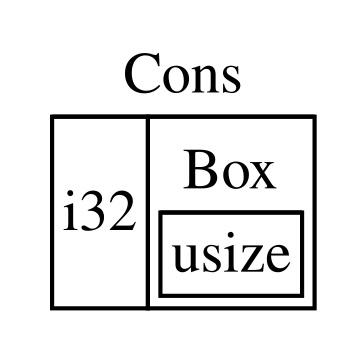

## Using `Box<T>` to Point to Data on the Heap

Sab se straightforward smart pointer box hai, jis ki type `Box<T>` likhi jati
hai. *Boxes* aapko data ko stack ke bajaye heap par store karne deti hain.
Stack par jo cheez rehti hai woh heap data ka pointer hota hai. Stack aur heap
ke darmiyan difference ko review karne ke liye Chapter 4 dekhein.

Boxes ka koi performance overhead nahi hota, siwaye is ke ke in ka data stack
ke bajaye heap par store hota hai. Lekin in mein bohat zyada extra
capabilities bhi nahi hotin. Aap inhein zyada tar in situations mein use
karenge:

* Jab aapke paas aisi type ho jis ka size compile time par maloom nahi kiya ja
  sakta, aur aap us type ki value ko aise context mein use karna chahte hon jahan
  exact size required ho
* Jab aapke paas bohat zyada data ho, aur aap ownership transfer karna chahte
  hon lekin yeh ensure karna chahte hon ke aisa karte waqt data copy na ho
* Jab aap kisi value ko own karna chahte hon, aur aapko sirf yeh parwah ho ke
  woh ek particular trait implement karti ho, na ke woh kisi specific type ki
  ho

Hum pehli situation ko [“Enabling Recursive Types with
Boxes”](#enabling-recursive-types-with-boxes)<!-- ignore --> mein demonstrate
karenge. Doosri situation mein, large amount of data ki ownership transfer karna
time le sakta hai kyun ke data stack par idhar-udhar copy hota hai. Is situation
mein performance improve karne ke liye, hum large amount of data ko box mein
heap par store kar sakte hain. Phir, stack par sirf pointer data ki chhoti si
amount copy hoti hai, jabke jis data ko woh reference karta hai woh heap par ek
hi jagah rehta hai. Teesri situation ko *trait object* kaha jata hai, aur
Chapter 18 mein [“Using Trait Objects to Abstract over Shared
Behavior”][trait-objects]<!-- ignore --> isi topic ke liye dedicated hai. Is
liye, jo aap yahan seekhenge usay aap us section mein dobara apply karenge!

<!-- Old headings. Do not remove or links may break. -->

<a id="using-boxt-to-store-data-on-the-heap"></a>

### Heap par Data Store Karna

`Box<T>` ke liye heap storage ke use case par baat karne se pehle, hum iska
syntax aur `Box<T>` ke andar stored values ke saath interact karne ka tareeqa
dekhenge.

Listing 15-1 dikhati hai ke heap par ek `i32` value store karne ke liye box ko
kaise use kiya jata hai.

<Listing number="15-1" file-name="src/main.rs" caption="Box ko use karke heap par ek `i32` value store karna">

```rust
{{#rustdoc_include ../listings/ch15-smart-pointers/listing-15-01/src/main.rs}}
```

</Listing>

Hum variable `b` ko ek `Box` ki value dete hain jo `5` ki taraf point karti
hai, aur `5` heap par allocate hoti hai. Yeh program `b = 5` print karega; is
case mein hum box ke andar data ko bilkul usi tarah access kar sakte hain jaise
hum karte agar yeh data stack par hota. Kisi bhi owned value ki tarah, jab box
scope se bahar chala jata hai, jaise `main` ke end par `b` hota hai, to woh
deallocated ho jata hai. Deallocation box (jo stack par stored hai) aur us data
dono ke liye hoti hai jiski taraf box point karta hai (jo heap par stored hai).

Heap par ek single value rakhna zyada useful nahi hai, is liye aap boxes ko
akelay is tarah bohat zyada use nahi karenge. Zyada tar situations mein stack
par single `i32` jaisi values rakhna, jahan woh default taur par stored hoti
hain, zyada munasib hai. Ab ek aisi situation dekhte hain jahan boxes humein
aisi types define karne ki ijazat dete hain jinhein hum boxes ke baghair define
nahi kar sakte.

### Boxes ke Saath Recursive Types ko Enable Karna

Ek *recursive type* ki value ke andar khud usi type ki ek aur value uska hissa
ho sakti hai. Recursive types ek issue paida karti hain kyun ke Rust ko compile time
par yeh pata hona zaroori hai ke kisi type ko kitni space chahiye. Lekin recursive
types ki values ki nesting theoretically infinitely continue ho sakti hai, is liye
Rust yeh nahi jaan sakta ke value ko kitni space ki zaroorat hai. Kyun ke boxes ka
size known hota hai, hum recursive type ki definition mein ek box insert karke
recursive types ko enable kar sakte hain.

Recursive type ki ek example ke taur par, aaiye cons list ko explore karte hain.
Yeh ek data type hai jo functional programming languages mein commonly milta hai.
Jo cons list type hum define karenge woh recursion ke ilawa straightforward hai;
is liye, is example mein jin concepts ke saath hum kaam karenge woh kisi bhi waqt
useful honge jab aap recursive types se related zyada complex situations mein
kaam karenge.

<!-- Old headings. Do not remove or links may break. -->

<a id="more-information-about-the-cons-list"></a>

#### Cons List ko Samajhna

Ek *cons list* ek data structure hai jo Lisp programming language aur uski
dialects se aata hai, nested pairs par mushtamil hota hai, aur linked list ka
Lisp version hai. Iska naam Lisp ke `cons` function se aata hai (*construct
function* ka short form), jo apne do arguments se ek naya pair construct karta
hai. Kisi value aur doosre pair par mushtamil pair par `cons` call karke hum
recursive pairs se bani hui cons lists construct kar sakte hain.

Misal ke taur par, yahan `1, 2, 3` list par mushtamil cons list ki pseudocode
representation hai, jisme har pair parentheses mein hai:

```text
(1, (2, (3, Nil)))
```

Cons list mein har item do elements contain karta hai: current item ki value aur
next item ki value. List ke aakhri item mein sirf ek value hoti hai jise
`Nil` kaha jata hai aur uske baad koi next item nahi hota. Ek cons list
`cons` function ko recursively call karne se produce hoti hai. Recursion ke
base case ko denote karne ke liye canonical name `Nil` hai. Note karein ke yeh
Chapter 6 mein discuss kiye gaye “null” ya “nil” concept ke samaan nahi hai,
jo ek invalid ya absent value hoti hai.

Cons list Rust mein commonly used data structure nahi hai. Zyada tar waqt jab
aapke paas Rust mein items ki list hoti hai, to `Vec<T>` use karna behtar choice
hota hai. Doosri, zyada complex recursive data types mukhtalif situations mein
useful *hain*, lekin is chapter mein cons list se shuru karke hum yeh explore
kar sakte hain ke boxes humein zyada distraction ke baghair recursive data type
define karne kaise dete hain.

Listing 15-2 mein cons list ke liye ek enum definition hai. Note karein ke yeh
code abhi compile nahi hoga, kyun ke `List` type ka size known nahi hai, jise
hum demonstrate karenge.

<Listing number="15-2" file-name="src/main.rs" caption="`i32` values ke cons list data structure ko represent karne ke liye enum define karne ki pehli koshish">

```rust,ignore,does_not_compile
{{#rustdoc_include ../listings/ch15-smart-pointers/listing-15-02/src/main.rs:here}}
```

</Listing>

> Note: Is example ke maqsad ke liye hum ek aisi cons list implement kar rahe
> hain jo sirf `i32` values hold karti hai. Hum generics ko use karke bhi ise
> implement kar sakte the, jaisa ke humne Chapter 10 mein discuss kiya tha, taake
> ek aisi cons list type define ki ja sake jo kisi bhi type ki values store kar
> sake.

`List` type ko `1, 2, 3` list store karne ke liye use karna Listing 15-3 ke code
jaisa hoga.

<Listing number="15-3" file-name="src/main.rs" caption="`List` enum ko `1, 2, 3` list store karne ke liye use karna">

```rust,ignore,does_not_compile
{{#rustdoc_include ../listings/ch15-smart-pointers/listing-15-03/src/main.rs:here}}
```

</Listing>

Pehli `Cons` value `1` aur ek doosri `List` value hold karti hai. Yeh `List`
value ek aur `Cons` value hai jo `2` aur ek doosri `List` value hold karti hai.
Yeh `List` value ek aur `Cons` value hai jo `3` aur ek `List` value hold karti
hai, jo aakhir mein `Nil` hai, yani non-recursive variant jo list ke end ko
signal karta hai.

Agar hum Listing 15-3 ke code ko compile karne ki koshish karein, to humein
Listing 15-4 mein dikhaya gaya error milta hai.

<Listing number="15-4" caption="Recursive enum ko define karne ki koshish karne par milne wala error">

```console
{{#include ../listings/ch15-smart-pointers/listing-15-03/output.txt}}
```

</Listing>

Error dikhata hai ke is type ka “infinite size” hai. Iski wajah yeh hai ke humne
`List` ko ek aise variant ke saath define kiya hai jo recursive hai: Yeh directly
khud ki ek aur value hold karta hai. Iske result mein, Rust yeh figure out nahi
kar sakta ke `List` value ko store karne ke liye kitni space ki zaroorat hai.
Aaiye is baat ko breakdown karte hain ke humein yeh error kyun milta hai. Sab se
pehle, hum dekhenge ke Rust kaise decide karta hai ke non-recursive type ki value
ko store karne ke liye kitni space ki zaroorat hai.

#### Non-Recursive Type ka Size Calculate Karna

Chapter 6 mein enum definitions discuss karte waqt Listing 6-2 mein define kiye gaye
`Message` enum ko yaad karein:

```rust
{{#rustdoc_include ../listings/ch06-enums-and-pattern-matching/listing-06-02/src/main.rs:here}}
```

Yeh determine karne ke liye ke `Message` value ke liye kitni space allocate karni
hai, Rust har variant ko dekhta hai taake pata chal sake ke kis variant ko sab se
zyada space chahiye. Rust dekhta hai ke `Message::Quit` ko kisi space ki zaroorat
nahi, `Message::Move` ko do `i32` values store karne ke liye kaafi space chahiye,
aur isi tarah baaqi variants ko dekhta hai. Kyun ke ek waqt mein sirf ek variant
use hoga, is liye `Message` value ko jitni sab se zyada space chahiye hogi, woh
uske sab se bade variant ko store karne jitni space hogi.

Iska muqabla is baat se karein ke jab Rust Listing 15-2 mein diye gaye `List`
enum jaise recursive type ke liye required space determine karne ki koshish
karta hai to kya hota hai. Compiler `Cons` variant ko dekhne se shuru karta hai,
jo `i32` type ki ek value aur `List` type ki ek value hold karta hai. Is liye
`Cons` ko ek `i32` ke size ke barabar space plus ek `List` ke size ke barabar
space chahiye. Yeh figure out karne ke liye ke `List` type ko kitni memory
chahiye, compiler variants ko dekhta hai, `Cons` variant se shuru karte hue.
`Cons` variant `i32` type ki ek value aur `List` type ki ek value hold karta hai,
aur yeh process infinitely continue hota rehta hai, jaisa ke Figure 15-1 mein
dikhaya gaya hai.


<span class="caption">Figure 15-1: Infinite `Cons` variants par mushtamil ek infinite `List`</span>

<!-- Old headings. Do not remove or links may break. -->

<a id="using-boxt-to-get-a-recursive-type-with-a-known-size"></a>

#### Known Size ke Saath Recursive Type Hasil Karna

Kyun ke Rust yeh figure out nahi kar sakta ke recursively defined types ke liye
kitni space allocate karni hai, compiler is helpful suggestion ke saath error
deta hai:

<!-- manual-regeneration
after doing automatic regeneration, look at listings/ch15-smart-pointers/listing-15-03/output.txt and copy the relevant line
-->

```text
help: insert some indirection (e.g., a `Box`, `Rc`, or `&`) to break the cycle
  |
2 |     Cons(i32, Box<List>),
  |               ++++    +
```

Is suggestion mein, *indirection* ka matlab hai ke value ko directly store karne
ke bajaye, humein data structure ko is tarah change karna chahiye ke value ko
indirectly store kiya jaye, yani value ke pointer ko store kiya jaye.

Kyun ke `Box<T>` ek pointer hai, Rust hamesha jaanta hai ke `Box<T>` ko kitni
space chahiye: Pointer ka size us data ki amount ke mutabiq change nahi hota
jis ki taraf woh point kar raha hota hai. Iska matlab hai ke hum `Cons` variant
ke andar directly ek aur `List` value rakhne ke bajaye `Box<T>` rakh sakte hain.
`Box<T>` next `List` value ki taraf point karega jo heap par hogi, `Cons` variant
ke andar nahi. Conceptually, hamare paas ab bhi ek list hai, jo aisi lists se
bani hai jo doosri lists ko hold karti hain, lekin ab yeh implementation ek
doosre ke andar items rakhne ke bajaye unhein ek doosre ke paas rakhne jaisi hai.

Hum Listing 15-2 mein `List` enum ki definition aur Listing 15-3 mein `List` ke
usage ko Listing 15-5 ke code mein change kar sakte hain, jo compile ho jayega.

<Listing number="15-5" file-name="src/main.rs" caption="Known size hasil karne ke liye `Box<T>` use karne wali `List` ki definition">

```rust
{{#rustdoc_include ../listings/ch15-smart-pointers/listing-15-05/src/main.rs}}
```

</Listing>

`Cons` variant ko ek `i32` ke size ke saath box ke pointer data ko store karne
ke liye required space chahiye. `Nil` variant koi values store nahi karta, is
liye ise `Cons` variant ke muqable mein stack par kam space chahiye. Ab hum jaante
hain ke koi bhi `List` value ek `i32` ke size plus box ke pointer data ke size
jitni space legi. Box use karke humne infinite, recursive chain ko break kar diya
hai, is liye compiler ab yeh figure out kar sakta hai ke `List` value ko store
karne ke liye kitni space chahiye. Figure 15-2 dikhati hai ke ab `Cons` variant
kaisa nazar aata hai.



<span class="caption">Figure 15-2: Ek `List` jo infinitely sized nahi hai, kyun ke `Cons` ek `Box` hold karta hai</span>

Boxes sirf indirection aur heap allocation provide karte hain; inke paas koi
doosri special capabilities nahi hoti, jaisi ke hum doosri smart pointer types
ke saath dekhenge. Inke paas woh performance overhead bhi nahi hota jo in special
capabilities ki wajah se incur hota hai, is liye yeh cons list jaise cases mein
useful ho sakte hain jahan indirection hi woh ek feature hai jiski humein
zaroorat hai. Chapter 18 mein hum boxes ke aur use cases dekhenge.

`Box<T>` type ek smart pointer hai kyun ke yeh `Deref` trait implement karta hai,
jo `Box<T>` values ko references ki tarah treat karne ki ijazat deta hai. Jab
`Box<T>` value scope se bahar chali jati hai, to box jis heap data ki taraf point
kar raha hota hai woh bhi clean up ho jata hai kyun ke `Drop` trait ki
implementation hoti hai. Yeh dono traits un doosre smart pointer types ki
functionality ke liye aur bhi important honge jin par hum is chapter ke baqi
hisson mein baat karenge. Aaiye in dono traits ko zyada detail mein explore
karte hain.

[trait-objects]: ch18-02-trait-objects.html#using-trait-objects-to-abstract-over-shared-behavior
