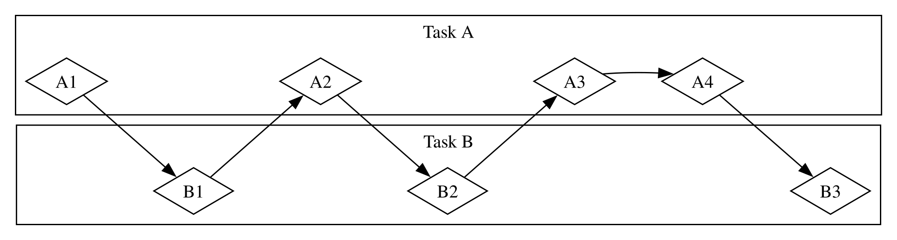
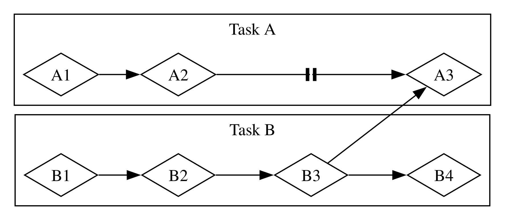

# Fundamentals of Asynchronous Programming: Async, Await, Futures, and Streams

Computer se hum jo bohot se operations karne ko kehte hain, unhein complete hone mein kuch
waqt lag sakta hai. Agar hum in long-running processes ke complete hone ka wait karte hue
kuch aur kar saken to acha hoga. Modern computers ek waqt mein ek se zyada operations par
kaam karne ke liye do techniques offer karte hain: parallelism aur concurrency. Hamare
programs ki logic, however, zyada tar linear fashion mein likhi jati hai. Hum yeh specify
karne ke qabil hona chahte hain ke program ko kaun se operations perform karne chahiye aur
woh points jahan ek function pause ho sakta hai aur program ka koi doosra hissa is ke bajaye
run ho sakta hai, bina is ke ke humein pehle se exactly order aur manner specify karna pade
ke code ka har hissa kis tarah run hona chahiye. *Asynchronous programming* ek abstraction
hai jo humein apne code ko potential pausing points aur eventual results ke terms mein
express karne deti hai aur coordination ki details khud handle karti hai.

Yeh chapter Chapter 16 mein parallelism aur concurrency ke liye threads ke use par build karta
hai aur code likhne ke ek alternative approach ko introduce karta hai: Rust ke futures,
streams, aur `async` aur `await` syntax, jo humein express karne dete hain ke operations
asynchronous ho sakte hain, aur third-party crates jo asynchronous runtimes implement karti
hain: yani aisa code jo asynchronous operations ki execution ko manage aur coordinate karta hai.

Aaiye ek example par ghaur karte hain. Maan lein aap ek family celebration ki banayi hui
video export kar rahe hain, ek aisa operation jo minutes se le kar hours tak le sakta hai.
Video export jitni CPU aur GPU power available ho sakti hai utni use karega. Agar aapke paas
sirf ek CPU core hota aur aapka operating system export ko complete hone tak pause na karta—
yani, agar woh export ko *synchronously* execute karta— to aap us task ke run hone ke dauran
apne computer par aur kuch nahi kar sakte. Yeh kaafi frustrating experience hota.
Fortunately, aapke computer ka operating system export ko itni dafa aur itne frequently
invisibly interrupt kar sakta hai, aur karta hai, ke aap simultaneously doosra kaam kar saken.

Ab maan lein aap kisi doosre shakhs ki share ki hui video download kar rahe hain, jo bhi kuch
waqt le sakti hai lekin utna CPU time nahi leti. Is case mein, CPU ko network se data
arrive hone ka wait karna padta hai. Jab data arrive hona start hota hai to aap use read
karna shuru kar sakte hain, lekin is ke tamam data ko appear hone mein kuch waqt lag sakta
hai. Data tamam present hone ke baad bhi, agar video kaafi large hai, to usay poora load
hone mein kam az kam ek ya do seconds lag sakte hain. Shayad yeh zyada waqt na lage, lekin
modern processor ke liye yeh bohot lamba waqt hai, jo har second billions of operations
perform kar sakta hai. Phir se, aapka operating system aapke program ko invisibly interrupt
karega taake network call ke finish hone ka wait karte hue CPU doosra kaam perform kar sake.

Video export ek *CPU-bound* ya *compute-bound* operation ki example hai. Yeh CPU ya GPU ke
andar computer ki potential data processing speed se, aur is baat se limited hai ke woh
apni kitni speed is operation ke liye dedicate kar sakta hai. Video download ek
*I/O-bound* operation ki example hai, kyun ke yeh computer ke *input and output* ki speed
se limited hai; yeh sirf utni speed se chal sakta hai jitni speed se data network ke zariye
send kiya ja sakta hai.

In dono examples mein, operating system ke invisible interrupts concurrency ki ek form
provide karte hain. Yeh concurrency sirf poore program ke level par hoti hai, though:
operating system ek program ko interrupt karta hai taake doosre programs apna kaam kar
saken. Bohot se cases mein, kyun ke hum apne programs ko operating system ki nisbat bohot
zyada granular level par samajhte hain, hum concurrency ke aise opportunities dekh sakte
hain jinhein operating system nahi dekh sakta.

Misal ke taur par, agar hum file downloads manage karne ke liye koi tool build kar rahe hain,
to humein apna program is tarah likhne ke qabil hona chahiye ke ek download start karne se
UI lock up na ho, aur users ek hi waqt mein multiple downloads start kar saken. Network ke
saath interact karne wali bohot si operating system APIs, though, *blocking* hoti hain;
yani, woh program ki progress ko us waqt tak block karti hain jab tak jis data ko woh process
kar rahi hain woh completely ready na ho.

> Note: Agar aap is baare mein sochein, to isi tarah *most* function calls kaam karti hain.
> However, term *blocking* aam tor par un function calls ke liye reserved hota hai jo files,
> network, ya computer par maujood doosre resources ke saath interact karti hain, kyun ke yeh
> woh cases hain jahan ek individual program ko operation ke *non*-blocking hone se faida
> ho sakta hai.

Hum har file ko download karne ke liye ek dedicated thread spawn karke apne main thread ko
blocking se bacha sakte hain. Lekin un threads ke use hone wale system resources ka
overhead aakhirkar ek problem ban jayega. Behtar yeh hoga ke call pehle se block na kare,
aur is ke bajaye hum kai tasks define kar saken jinhein hum apne program se complete karwana
chahte hain aur runtime ko unhein run karne ka best order aur manner choose karne dein.

Yahi exactly Rust ki *async* (*asynchronous* ka short form) abstraction humein deti hai. Is
chapter mein, aap async ke baare mein sab kuch seekhenge jab hum following topics cover
karengay:

* Rust ki `async` aur `await` syntax ko kaise use karein aur asynchronous
  functions ko runtime ke saath execute karein
* Async model ko use karke Chapter 16 mein dekhe gaye kuch same challenges ko kaise solve karein
* Multithreading aur async complementary solutions kaise provide karte hain jinhein aap
  bohot se cases mein combine kar sakte hain

Lekin, is se pehle ke hum dekhein ke async practical taur par kaise kaam karta hai, humein
parallelism aur concurrency ke darmiyan differences discuss karne ke liye ek short
detour lena hoga.

## Parallelism and Concurrency

Ab tak humne parallelism aur concurrency ko zyada tar interchangeable terms ke taur par
treat kiya hai. Ab humein inhein zyada precisely distinguish karna hoga, kyun ke jaise hi
hum kaam karna shuru karenge, in dono ke differences saamne aayenge.

Ghaur karein ke ek team software project par kaam ko kis tarah different ways mein divide
kar sakti hai. Aap ek single member ko multiple tasks assign kar sakte hain, har member ko
ek task assign kar sakte hain, ya in dono approaches ka mix use kar sakte hain.

Jab koi individual kai different tasks par kaam karta hai aur un mein se koi bhi abhi
complete nahi hua hota, to yeh *concurrency* hai. Concurrency ko implement karne ka ek tareeqa
kuch is tarah hai jaise aapke computer par do different projects checked out hon, aur jab aap
ek project se bore ho jayein ya us mein stuck ho jayein, to doosre project par switch kar
jayein. Aap sirf ek person hain, is liye aap dono tasks par exact same time par progress nahi
kar sakte, lekin aap multitask kar sakte hain, yani ek waqt mein ek task par progress karte
hue unke darmiyan switch kar sakte hain (Figure 17-1 dekhein).

<figure>

<figcaption>Figure 17-1: A concurrent workflow, switching between Task A and Task B</figcaption>

</figure>

Jab team tasks ke ek group ko is tarah split karti hai ke har member ek task le aur us par
akele kaam kare, to yeh *parallelism* hai. Team ka har person exact same time par progress
kar sakta hai (Figure 17-2 dekhein).

<figure>

<figcaption>Figure 17-2: A parallel workflow, where work happens on Task A and Task B independently</figcaption>

</figure>

In dono workflows mein, aapko different tasks ke darmiyan coordinate karna par sakta hai.
Ho sakta hai aapne socha ho ke ek person ko assign kiya gaya task baqi sab ke work se totally
independent tha, lekin asal mein usay complete karne ke liye team ke kisi doosre person ko
pehle apna task finish karna zaroori ho. Kuch work parallel mein kiya ja sakta hai, lekin
kuch asal mein *serial* tha: woh sirf ek series mein, ek task ke baad doosra task karke hi
ho sakta tha, jaisa ke Figure 17-3 mein hai.

<figure>

<figcaption>Figure 17-3: A partially parallel workflow, where work happens on Task A and Task B independently until Task A3 is blocked on the results of Task B3.</figcaption>

</figure>

Isi tarah, aap realize kar sakte hain ke aapke apne tasks mein se koi ek task aapke kisi
doosre task par depend karta hai. Ab aapka concurrent work bhi serial ban gaya hai.

Parallelism aur concurrency ek doosre ke saath intersect bhi kar sakte hain. Agar aapko pata
chale ke koi colleague tab tak stuck hai jab tak aap apna ek task finish nahi kar lete, to
aap shayad apni tamam efforts us task par focus karenge taake apne colleague ko “unblock”
kar saken. Aap aur aapka coworker ab parallel mein kaam nahi kar sakte, aur aap apne tasks
par concurrently kaam bhi nahi kar sakte.

Software aur hardware mein bhi yahi basic dynamics apply hoti hain. Single CPU core wali
machine par CPU ek waqt mein sirf ek operation perform kar sakta hai, lekin phir bhi woh
concurrently kaam kar sakta hai. Threads, processes, aur async jaise tools ko use karke,
computer ek activity ko pause kar sakta hai aur doosri activities par switch kar sakta hai,
aur baad mein cycling karke dobara pehli activity par aa sakta hai. Multiple CPU cores wali
machine par, yeh parallel mein bhi work kar sakti hai. Ek core ek task perform kar raha ho
sakta hai jabke doosra core bilkul unrelated task perform kar raha ho, aur woh operations
waqai same time par ho rahe hote hain.

Rust mein async code run karna aam tor par concurrently hota hai. Hardware, operating
system, aur hum jo async runtime use kar rahe hain us ke mutabiq (async runtimes ke baare
mein thori dair mein zyada baat hogi), yeh concurrency under the hood parallelism bhi use
kar sakti hai.

Ab aaiye is baat mein dive karte hain ke Rust mein async programming asal mein kaise kaam
karti hai.
