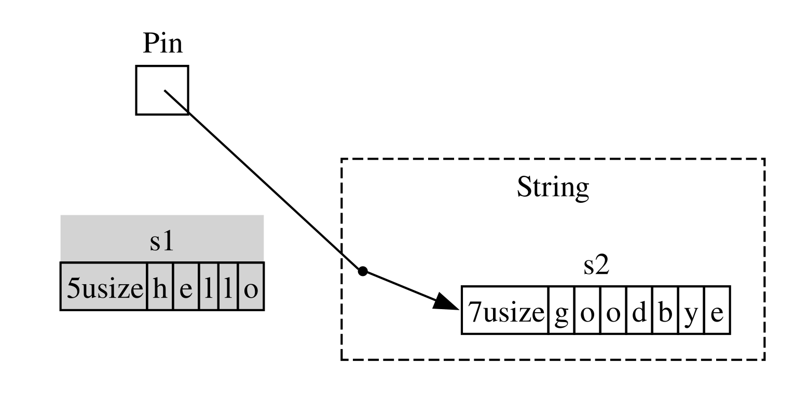

<!-- Old headings. Do not remove or links may break. -->

<a id="digging-into-the-traits-for-async"></a>

## A Closer Look at the Traits for Async

Poore chapter mein, humne `Future`, `Stream`, aur `StreamExt` traits ko mukhtalif tareeqon se
use kiya hai. Ab tak, humne is baat ki details mein zyada jane se parhez kiya hai ke yeh kaise
work karte hain ya ek doosre ke saath kaise fit hote hain, jo aapke day-to-day Rust work ke liye
zyada tar waqt bilkul theek hai. Kabhi kabhi, though, aap aisi situations mein aa sakte hain jahan
aapko in traits ki kuch mazeed details samajhne ki zaroorat hogi, saath hi `Pin` type aur `Unpin`
trait ko bhi samajhna hoga. Is section mein, hum sirf itni gehrai tak jayenge ke un scenarios
mein aapki madad ho sake, jab ke *really* deep dive ko doosri documentation ke liye chhor denge.

<!-- Old headings. Do not remove or links may break. -->

<a id="future"></a>

### The `Future` Trait

Aaiye `Future` trait kaise work karta hai, is par zara qareeb se nazar daalne se shuru karte hain. Rust isay is tarah define karta hai:

```rust
use std::pin::Pin;
use std::task::{Context, Poll};

pub trait Future {
    type Output;

    fn poll(self: Pin<&mut Self>, cx: &mut Context<'_>) -> Poll<Self::Output>;
}
```

Is trait definition mein bohot se naye types hain aur kuch aisi syntax bhi hai jo humne abhi tak nahi dekhi, is liye aaiye definition ko piece by piece samajhte hain.

Sab se pehle, `Future` ka associated type `Output` batata hai ke future kis value mein resolve hota hai. Yeh `Iterator` trait ke `Item` associated type ke analogous hai. Doosra, `Future` mein `poll` method hai, jo apne `self` parameter ke liye ek special `Pin` reference aur `Context` type ka ek mutable reference leta hai, aur `Poll<Self::Output>` return karta hai. Hum `Pin` aur `Context` ke baare mein thori der mein mazeed baat karenge. Filhal, aaiye is baat par focus karte hain ke method kya return karta hai, yani `Poll` type:

```rust
pub enum Poll<T> {
    Ready(T),
    Pending,
}
```

Yeh `Poll` type `Option` ke similar hai. Is mein ek variant aisa hai jis mein value hoti hai, `Ready(T)`, aur ek aisa hai jis mein value nahi hoti, `Pending`. Lekin `Poll` ka matlab `Option` se kaafi different hai! `Pending` variant indicate karta hai ke future ko abhi bhi kuch work karna hai, is liye caller ko baad mein dobara check karna hoga. `Ready` variant indicate karta hai ke `Future` ne apna work complete kar liya hai aur `T` value available hai.

> Note: Directly `poll` call karne ki zaroorat rare hoti hai, lekin agar aapko karni pade, to yeh baat zehan mein rakhein ke zyada tar futures ke saath, future ke `Ready` return karne ke baad caller ko dobara `poll` call nahi karna chahiye. Bohot se futures ready hone ke baad dobara poll kiye jane par panic karenge. Jo futures dobara safely poll kiye ja sakte hain, unki documentation mein is baat ko explicitly bataya jayega. Yeh is baat ke similar hai ke `Iterator::next` ka behavior hota hai.

Jab aap aisa code dekhte hain jo `await` use karta hai, to Rust internally usay aise code mein compile karta hai jo `poll` call karta hai. Agar aap Listing 17-4 ko dobara dekhein, jahan humne ek single URL ke page title ko resolve hone ke baad print kiya tha, to Rust usay kuch is tarah (although exactly nahi) compile karta hai:

```rust,ignore
match page_title(url).poll() {
    Ready(page_title) => match page_title {
        Some(title) => println!("The title for {url} was {title}"),
        None => println!("{url} had no title"),
    }
    Pending => {
        // Lekin yahan kya jayega?
    }
}
```

Jab future abhi bhi `Pending` ho to humein kya karna chahiye? Humein dobara, aur dobara, aur dobara try karne ka koi tareeqa chahiye, jab tak future aakhirkar ready na ho jaye. Doosre lafzon mein, humein ek loop chahiye:

```rust,ignore
let mut page_title_fut = page_title(url);
loop {
    match page_title_fut.poll() {
        Ready(value) => match page_title {
            Some(title) => println!("The title for {url} was {title}"),
            None => println!("{url} had no title"),
        }
        Pending => {
            // continue
        }
    }
}
```

Agar Rust isay exactly isi code mein compile karta, to har `await` blocking hota—bilkul us ke opposite jo hum achieve karna chah rahe thay! Is ke bajaye, Rust ensure karta hai ke loop control kisi aisi cheez ko hand off kar sake jo is future par work ko pause karke doosre futures par work kare aur phir baad mein is future ko dobara check kare. Jaisa ke humne dekha hai, woh cheez async runtime hai, aur scheduling aur coordination ka yeh work us ke main jobs mein se ek hai.

[“Sending Data Between Two Tasks Using Message
Passing”][message-passing]<!-- ignore --> section mein humne `rx.recv` par wait karne ko describe kiya tha. `recv` call ek future return karta hai, aur future ko await karna usay poll karta hai. Humne note kiya tha ke runtime future ko us waqt tak pause karega jab tak woh channel close hone par `Some(message)` ya `None` mein ready nahi ho jata. `Future` trait, aur khaas taur par `Future::poll`, ki ab hamari deeper understanding ke saath, hum dekh sakte hain ke yeh kaise work karta hai. Jab future `Poll::Pending` return karta hai to runtime jaanta hai ke future ready nahi hai. Is ke baraks, jab `poll` `Poll::Ready(Some(message))` ya `Poll::Ready(None)` return karta hai to runtime jaanta hai ke future *ready* hai aur usay aage advance karta hai.

Runtime yeh exactly kaise karta hai, is ki details is book ke scope se bahar hain, lekin key baat futures ki basic mechanics ko samajhna hai: runtime har us future ko *poll* karta hai jis ki woh responsibility leta hai, aur jab future abhi ready na ho to usay dobara sleep mein daal deta hai.

<!-- Old headings. Do not remove or links may break. -->

<a id="pinning-and-the-pin-and-unpin-traits"></a> <a id="the-pin-and-unpin-traits"></a>

### The `Pin` Type and the `Unpin` Trait

Listing 17-13 mein humne teen futures ko await karne ke liye `trpl::join!` macro use kiya tha. Lekin aksar hamare paas ek aisi collection hoti hai, jaise ek vector, jis mein kuch number of futures hote hain aur jin ki tadaad runtime tak maloom nahi hoti. Aaiye Listing 17-13 ko Listing 17-23 ke code mein change karte hain, jo teen futures ko ek vector mein rakhta hai aur phir `trpl::join_all` function call karta hai, jo abhi compile nahi hoga.

<Listing number="17-23" caption="Awaiting futures in a collection"  file-name="src/main.rs">

```rust,ignore,does_not_compile
{{#rustdoc_include ../listings/ch17-async-await/listing-17-23/src/main.rs:here}}
```

</Listing>

Humne har future ko ek `Box` ke andar rakha hai taake unhein *trait objects* mein badla ja sake, bilkul usi tarah jaisa humne Chapter 12 ke “Returning Errors from `run`” section mein kiya tha. (Hum Chapter 18 mein trait objects ko detail mein cover karenge.) Trait objects use karne se hum in types se produce hone wale har anonymous future ko ek hi type ki tarah treat kar sakte hain, kyun ke yeh sab `Future` trait ko implement karte hain.

Yeh shayad surprising ho. Aakhir, in mein se koi bhi async block kuch return nahi karta, is liye har ek `Future<Output = ()>` produce karta hai. Lekin yaad rakhein ke `Future` ek trait hai, aur compiler har async block ke liye ek unique enum create karta hai, chahe un ke output types identical hi kyun na hon. Jis tarah aap do different handwritten structs ko ek `Vec` mein nahi rakh sakte, usi tarah aap compiler-generated enums ko mix nahi kar sakte.

Phir hum futures ki collection ko `trpl::join_all` function ko pass karte hain aur result ko await karte hain. Lekin yeh compile nahi hota; error messages ka relevant hissa yeh hai.

<!-- manual-regeneration
cd listings/ch17-async-await/listing-17-23
cargo build
copy *only* the final `error` block from the errors
-->

```text
error[E0277]: `dyn Future<Output = ()>` cannot be unpinned
  --> src/main.rs:48:33
   |
48 |         trpl::join_all(futures).await;
   |                                 ^^^^^ the trait `Unpin` is not implemented for `dyn Future<Output = ()>`
   |
   = note: consider using the `pin!` macro
           consider using `Box::pin` if you need to access the pinned value outside of the current scope
   = note: required for `Box<dyn Future<Output = ()>>` to implement `Future`
note: required by a bound in `futures_util::future::join_all::JoinAll`
  --> file:///home/.cargo/registry/src/index.crates.io-1949cf8c6b5b557f/futures-util-0.3.30/src/future/join_all.rs:29:8
   |
27 | pub struct JoinAll<F>
   |            ------- required by this bound in `JoinAll`
28 | where
29 |     F: Future,
   |        ^^^^^^ required by this bound in `JoinAll`
```

Is error message mein diya gaya note humein batata hai ke humein values ko *pin* karne ke liye `pin!` macro use karna chahiye, jis ka matlab hai unhein `Pin` type ke andar rakhna jo guarantee karta hai ke values memory mein move nahi hongi. Error message ke mutabiq pinning is liye required hai kyun ke `dyn Future<Output = ()>` ko `Unpin` trait implement karna zaroori hai aur filhal yeh isay implement nahi karta.

`trpl::join_all` function ek `JoinAll` naam ka struct return karta hai. Yeh struct ek type `F` ke liye generic hai, jo `Future` trait implement karne ki condition rakhta hai. Kisi future ko directly `await` karna future ko implicitly pin kar deta hai. Isi liye humein har jagah jahan futures ko await karna ho, `pin!` use karne ki zaroorat nahi hoti.

Lekin yahan hum directly kisi future ko await nahi kar rahe. Is ke bajaye, hum `join_all` function ko futures ki collection pass karke ek naya future, `JoinAll`, construct kar rahe hain. `join_all` ki signature require karti hai ke collection mein items ke types sab `Future` trait implement karte hon, aur `Box<T>` tabhi `Future` implement karta hai jab jis `T` ko woh wrap karta hai woh future `Unpin` trait implement karta ho.

Yeh samajhne ke liye kaafi kuch hai! Isay waqai samajhne ke liye, aaiye thora aur dekhein ke `Future` trait asal mein kaise work karta hai, khaas taur par pinning ke hawale se. `Future` trait ki definition ko dobara dekhein:

```rust
use std::pin::Pin;
use std::task::{Context, Poll};

pub trait Future {
    type Output;

    // Required method
    fn poll(self: Pin<&mut Self>, cx: &mut Context<'_>) -> Poll<Self::Output>;
}
```

`cx` parameter aur us ka `Context` type is baat ki key hain ke runtime asal mein kaise jaanta hai ke kisi given future ko kab check karna hai, jab ke future phir bhi lazy rehta hai. Dobara, is ke work karne ki details is chapter ke scope se bahar hain, aur aam tor par aapko is ke baare mein tabhi sochna padta hai jab aap custom `Future` implementation likh rahe hon. Is ke bajaye hum `self` ke type par focus karenge, kyun ke yeh pehli baar hai jab humne aisa method dekha hai jahan `self` ke paas type annotation hai. `self` ke liye type annotation doosre function parameters ke type annotations ki tarah work karta hai, lekin is mein do key differences hain:

* Yeh Rust ko batata hai ke method call hone ke liye `self` ka type kya hona chahiye.
* Yeh koi bhi type nahi ho sakta. Yeh us type tak restricted hai jis par method implement kiya gaya hai, us type ka reference ya smart pointer, ya phir us type ke reference ko wrap karta hua `Pin`.

Hum [Chapter 18][ch-18]<!-- ignore --> mein is syntax ke baare mein mazeed dekhenge. Filhal, itna jaanna kaafi hai ke agar hum future ko poll karke check karna chahte hain ke woh `Pending` hai ya `Ready(Output)`, to humein us type ka `Pin`-wrapped mutable reference chahiye.

`Pin` pointer-like types jaise `&`, `&mut`, `Box`, aur `Rc` ke liye ek wrapper hai. (Technically, `Pin` un types ke saath work karta hai jo `Deref` ya `DerefMut` traits implement karte hain, lekin effectively yeh sirf references aur smart pointers ke saath work karne ke equivalent hai.) `Pin` khud ek pointer nahi hai aur na hi is ka apna koi behavior hai, jaise `Rc` aur `Arc` reference counting ke saath karte hain; yeh purely ek tool hai jise compiler pointer usage par constraints enforce karne ke liye use kar sakta hai.

Yeh yaad karna ke `await`, `poll` ki calls ke terms mein implement hota hai, us error message ko samajhne mein madad karta hai jo humne pehle dekha tha, lekin woh `Pin` ke bajaye `Unpin` ke terms mein tha. To exactly `Pin` ka `Unpin` se kya relation hai, aur `Future` ko `poll` call karne ke liye `self` ka `Pin` type mein hona kyun zaroori hai?

Is chapter mein pehle ki baat yaad karein ke future mein await points ki ek series ko ek state machine mein compile kiya jata hai, aur compiler ensure karta hai ke woh state machine Rust ke safety se related tamam normal rules ko follow kare, jin mein borrowing aur ownership bhi shamil hain. Isay work karne ke liye, Rust dekhta hai ke ek await point aur ya to agle await point ya async block ke end ke darmiyan kaunsa data required hai. Phir woh compiled state machine mein corresponding variant create karta hai. Har variant ko us data tak woh access milta hai jis ki usay source code ke us section mein zaroorat hogi, chahe woh data ki ownership le kar ho ya us data ka mutable ya immutable reference hasil karke.

Ab tak sab theek hai: agar hum kisi given async block mein ownership ya references ke hawale se kuch ghalat karte hain, to borrow checker humein bata dega. Jab hum us block se corresponding future ko move karna chahte hain—jaise usay `join_all` ko pass karne ke liye ek `Vec` mein move karna—cheezen zyada tricky ho jati hain.

Jab hum ek future ko move karte hain—chahe `join_all` ke saath iterator ki tarah use karne ke liye usay kisi data structure mein push karke ya kisi function se return karke—asal mein iska matlab Rust ke banaye hue state machine ko move karna hota hai. Aur Rust ke zyada tar doosre types ke unlike, async blocks ke liye Rust jo futures create karta hai un mein kisi given variant ke fields ke andar khud apne references ho sakte hain, jaisa ke Figure 17-4 mein simplified illustration mein dikhaya gaya hai.
<figure>


<figcaption>Figure 17-4: A self-referential data type</figcaption>

</figure>

Lekin default tor par, koi bhi aisa object jis ka reference khud usi ki taraf ho, usay move karna unsafe hota hai, kyun ke references hamesha us actual memory address ki taraf point karte hain jis cheez ko woh refer kar rahe hote hain (Figure 17-5 dekhein). Agar aap data structure ko khud move kar dete hain, to us ke internal references purani location ki taraf point karte rahenge. Lekin ab woh memory location invalid hai. Ek wajah yeh hai ke jab aap data structure mein changes karenge to us ki value update nahi hogi. Doosri—aur zyada important—baat yeh hai ke computer ab us memory ko doosre purposes ke liye dobara use karne ke liye free hai! Baad mein aap bilkul unrelated data read kar sakte hain.

<figure>


<figcaption>Figure 17-5: The unsafe result of moving a self-referential data type</figcaption>

</figure>

Theoretically, Rust compiler koshish kar sakta hai ke jab bhi koi object move ho to us object ke har reference ko update kare, lekin is se performance ka bohot zyada overhead add ho sakta hai, khaas taur par agar references ke ek poore web ko update karna pade. Agar is ke bajaye hum yeh ensure kar saken ke jis data structure ki baat ho rahi hai woh *memory mein move na ho*, to humein koi references update nahi karne padenge. Rust ka borrow checker bilkul isi purpose ke liye hai: safe code mein, yeh aapko kisi bhi aise item ko move karne se rokta hai jis ka active reference ho.

`Pin` is guarantee par build karta hai aur humein woh exact guarantee deta hai jis ki humein zaroorat hai. Jab hum kisi value ko *pin* karte hain, yani us value ke pointer ko `Pin` mein wrap karte hain, to woh value ab move nahi ho sakti. Is liye, agar aapke paas `Pin<Box<SomeType>>` hai, to aap asal mein `SomeType` value ko pin kar rahe hain, *na ke* `Box` pointer ko. Figure 17-6 is process ko illustrate karti hai.

<figure>


<figcaption>Figure 17-6: Pinning a `Box` that points to a self-referential future type</figcaption>

</figure>

Darasal, `Box` pointer ab bhi freely move kar sakta hai. Yaad rakhein: humein is baat ki fikr hai ke jis data ko aakhir mein reference kiya ja raha hai woh apni jagah par rahe. Agar koi pointer move karta hai, *lekin woh data jis ki taraf pointer point karta hai* usi jagah par rehta hai, jaisa ke Figure 17-7 mein hai, to koi potential problem nahi hoti. (Ek independent exercise ke taur par, types ke docs ke saath saath `std::pin` module ke docs dekhein aur yeh samajhne ki koshish karein ke `Pin` jo `Box` ko wrap karta ho, us ke saath aap yeh kaise karenge.) Key baat yeh hai ke self-referential type khud move nahi ho sakta, kyun ke woh ab bhi pinned hai.

<figure>


<figcaption>Figure 17-7: Moving a `Box` which points to a self-referential future type</figcaption>

</figure>
Lekin zyada tar types ko move karna bilkul safe hota hai, chahe woh `Pin` pointer ke peeche hi kyun na hon. Humein pinning ke baare mein sirf tab sochne ki zaroorat hoti hai jab items mein internal references hon. Primitive values jaise numbers aur Booleans safe hain kyun ke zahir hai ke in mein koi internal references nahi hote. Rust mein jin types ke saath aap normally kaam karte hain, un mein se bhi zyada tar mein aisa nahi hota. Misal ke taur par, aap `Vec` ko bina fikr ke move kar sakte hain. Ab tak jo humne dekha hai us ki bunyaad par, agar aapke paas `Pin<Vec<String>>` ho, to aapko `Pin` ke provide kiye hue safe lekin restrictive APIs ke zariye hi sab kuch karna padega, halaan ke `Vec<String>` ko move karna hamesha safe hota hai agar us ke koi doosre references na hon. Humein compiler ko yeh batane ka koi tareeqa chahiye ke aise cases mein items ko move karna theek hai—aur yahin `Unpin` kaam aata hai.

`Unpin` ek marker trait hai, bilkul un `Send` aur `Sync` traits ki tarah jinhein humne Chapter 16 mein dekha tha, aur is liye is ki apni koi functionality nahi hoti. Marker traits ka maqsad sirf compiler ko yeh batana hota hai ke kisi particular context mein given trait ko implement karne wale type ko use karna safe hai. `Unpin` compiler ko batata hai ke given type ko is baat ke hawale se koi guarantees uphold karne ki zaroorat *nahi* hai ke concerned value ko safely move kiya ja sakta hai ya nahi.

<!--
  The inline `<code>` in the next block is to allow the inline `<em>` inside it,
  matching what NoStarch does style-wise, and emphasizing within the text here
  that it is something distinct from a normal type.
-->

`Send` aur `Sync` ki tarah, compiler har us type ke liye `Unpin` automatically implement karta hai jahan woh prove kar sakta hai ke yeh safe hai. Dobara, `Send` aur `Sync` ki tarah, ek special case woh hai jahan kisi type ke liye `Unpin` *implement nahi* hota. Is ke liye notation <code>impl !Unpin for <em>SomeType</em></code> hai, jahan <code><em>SomeType</em></code> us type ka naam hai jisay safe rehne ke liye jab bhi us type ka pointer `Pin` mein use ho, un guarantees ko uphold karna *zaroori* hota hai.

Doosre lafzon mein, `Pin` aur `Unpin` ke relationship ke baare mein do baatein zehan mein rakhni hain. Pehli, `Unpin` “normal” case hai, aur `!Unpin` special case hai. Doosri, koi type `Unpin` ya `!Unpin` implement karta hai ya nahi, yeh *sirf* tab matter karta hai jab aap us type ke liye pinned pointer use kar rahe hon, jaise <code>Pin<&mut <em>SomeType</em>></code>.

Isay concrete banane ke liye, ek `String` ke baare mein sochein: is mein ek length aur woh Unicode characters hote hain jo isay banate hain. Hum ek `String` ko `Pin` mein wrap kar sakte hain, jaisa ke Figure 17-8 mein dekha gaya hai. Lekin `String` automatically `Unpin` implement karta hai, aur Rust ke zyada tar doosre types bhi aisa hi karte hain.

<figure>


<figcaption>Figure 17-8: Pinning a `String`; the dotted line indicates that the `String` implements the `Unpin` trait and thus is not pinned</figcaption>

</figure>
Natije ke taur par, hum woh kaam kar sakte hain jo agar `String` `!Unpin` implement karta hota to illegal hote, jaise ek string ko memory mein bilkul usi location par doosri string se replace karna, jaisa ke Figure 17-9 mein hai. Yeh `Pin` contract ki khilaf-warzi nahi karta, kyun ke `String` mein koi internal references nahi hote jo isay move karna unsafe bana dein. Bilkul isi wajah se yeh `!Unpin` ke bajaye `Unpin` implement karta hai.

<figure>



<figcaption>Figure 17-9: Replacing the `String` with an entirely different `String` in memory</figcaption>

</figure>

Ab hum Listing 17-23 mein pehle ki gayi `join_all` call ke errors ko samajhne ke liye kaafi jaante hain. Humne originally async blocks se produce hone wale futures ko `Vec<Box<dyn Future<Output = ()>>>` mein move karne ki koshish ki thi, lekin jaisa ke humne dekha, un futures mein internal references ho sakte hain, is liye woh automatically `Unpin` implement nahi karte. Jab hum unhein pin kar dete hain, to hum resulting `Pin` type ko `Vec` mein pass kar sakte hain, is confidence ke saath ke futures mein underlying data *move nahi hoga*. Listing 17-24 dikhati hai ke har teen futures ko define karte waqt `pin!` macro call karke aur trait object type ko adjust karke code ko kaise fix kiya jata hai.

<Listing number="17-24" caption="Pinning the futures to enable moving them into the vector">

```rust
{{#rustdoc_include ../listings/ch17-async-await/listing-17-24/src/main.rs:here}}
```

</Listing>

Ab yeh example compile aur run hota hai, aur hum runtime par vector mein futures add ya remove kar sakte hain aur un sab ko join kar sakte hain.

`Pin` aur `Unpin` zyada tar lower-level libraries build karne ke liye important hain, ya jab aap khud ek runtime build kar rahe hon, na ke rozmarra ke Rust code ke liye. Lekin jab aap error messages mein in traits ko dekhein, to ab aapko apne code ko fix karne ka behtar idea hoga!

> Note: `Pin` aur `Unpin` ka yeh combination Rust mein complex types ki ek poori class ko safely implement karna possible banata hai jo warna challenging sabit hoti, kyun ke woh self-referential hoti hain. Jin types ko `Pin` ki zaroorat hoti hai, woh aaj kal sab se zyada async Rust mein nazar aate hain, lekin kabhi kabhar aap inhein doosre contexts mein bhi dekh sakte hain.
>
> `Pin` aur `Unpin exactly kaise work karte hain, aur unhein kin rules ko uphold karna zaroori hai, yeh `std::pin` ke API documentation mein extensively cover kiya gaya hai, is liye agar aap mazeed seekhne mein interested hain, to yeh shuru karne ke liye ek behtareen jagah hai.
>
> Agar aap aur bhi detail mein samajhna chahte hain ke under the hood cheezen kaise work karti hain, to [*Asynchronous Programming in Rust*][async-book] ke Chapters [2][under-the-hood]<!-- ignore --> aur [4][pinning]<!-- ignore --> dekhein.
### The `Stream` Trait

Ab jab aap `Future`, `Pin`, aur `Unpin` traits ko zyada gehrai se samajh chuke hain, to hum apni tawajjoh `Stream` trait ki taraf kar sakte hain. Jaisa ke aapne chapter mein pehle seekha, streams asynchronous iterators ke similar hote hain. Lekin `Iterator` aur `Future` ke unlike, is writing ke waqt `Stream` ki standard library mein koi definition nahi hai, lekin `futures` crate ki ek bohot common definition *hai* jo poore ecosystem mein use hoti hai.

Aaiye `Stream` trait ko dekhne se pehle `Iterator` aur `Future` traits ki definitions ko review karte hain aur dekhte hain ke `Stream` unhein kis tarah ek saath merge kar sakta hai. `Iterator` se humein sequence ka idea milta hai: is ka `next` method ek `Option<Self::Item>` provide karta hai. `Future` se humein waqt ke saath readiness ka idea milta hai: is ka `poll` method ek `Poll<Self::Output>` provide karta hai. Aisi items ki sequence represent karne ke liye jo waqt ke saath ready hoti hain, hum ek `Stream` trait define karte hain jo in features ko ek saath rakhta hai:

```rust
use std::pin::Pin;
use std::task::{Context, Poll};

trait Stream {
    type Item;

    fn poll_next(
        self: Pin<&mut Self>,
        cx: &mut Context<'_>
    ) -> Poll<Option<Self::Item>>;
}
```

`Stream` trait `Item` naam ka ek associated type define karta hai jo stream ke produce kiye gaye items ke type ko represent karta hai. Yeh `Iterator` ke similar hai, jahan zero se le kar bohot saare items ho sakte hain, aur `Future` se different hai, jahan hamesha ek single `Output` hota hai, chahe woh unit type `()` hi kyun na ho.

`Stream` in items ko hasil karne ke liye ek method bhi define karta hai. Hum isay `poll_next` kehte hain taake yeh clear ho ke yeh `Future::poll` ki tarah poll karta hai aur `Iterator::next` ki tarah items ki ek sequence produce karta hai. Is ka return type `Poll` ko `Option` ke saath combine karta hai. Outer type `Poll` hai, kyun ke isay readiness ke liye check karna hota hai, bilkul future ki tarah. Inner type `Option` hai, kyun ke isay signal karna hota hai ke mazeed messages hain ya nahi, bilkul iterator ki tarah.

Is definition se bohot milti-julti koi cheez mumkin hai ke Rust ki standard library ka hissa ban jaye. Filhal, yeh zyada tar runtimes ke toolkit ka hissa hai, is liye aap is par rely kar sakte hain, aur jo kuch hum agay cover karenge woh generally apply hona chahiye!

Lekin [“Streams: Futures in Sequence”][streams]<!--
ignore --> section mein jo examples humne dekhe thay, un mein humne `poll_next` *ya* `Stream` use nahi kiya tha, balkay `next` aur `StreamExt` use kiya tha. Hum zaroorat par directly `poll_next` API ke terms mein kaam kar sakte hain aur apni `Stream` state machines khud hand-write kar sakte hain, bilkul usi tarah jaise hum futures ke `poll` method ke zariye un ke saath directly kaam kar sakte hain. Lekin `await` use karna kaafi behtar hai, aur `StreamExt` trait `next` method provide karta hai taake hum bilkul yahi kar saken:

```rust
{{#rustdoc_include ../listings/ch17-async-await/no-listing-stream-ext/src/lib.rs:here}}
```

<!--
TODO: update this if/when tokio/etc. update their MSRV and switch to using async functions
in traits, since the lack thereof is the reason they do not yet have this.
-->

> Note: Actual definition jo humne chapter mein pehle use ki thi, woh is se thori different nazar aati hai, kyun ke yeh Rust ke un versions ko support karti hai jo abhi traits mein async functions use karne ko support nahi karte thay. Natije ke taur par, yeh is tarah nazar aati hai:
>
> ```rust,ignore
> fn next(&mut self) -> Next<'_, Self> where Self: Unpin;
> ```
>
> `Next` type ek `struct` hai jo `Future` implement karta hai aur humein `self` ke reference ki lifetime ko `Next<'_, Self>` ke saath name karne deta hai, taake `await` is method ke saath work kar sake.

`StreamExt` trait streams ke saath use karne ke liye available tamam interesting methods ka bhi home hai. `StreamExt` har us type ke liye automatically implement hota hai jo `Stream` implement karta hai, lekin yeh traits separately define kiye gaye hain taake community foundational trait ko affect kiye baghair convenience APIs par iterate kar sake.

`trpl` crate mein use hone wale `StreamExt` ke version mein, trait na sirf `next` method define karta hai balkay `next` ki ek default implementation bhi provide karta hai jo `Stream::poll_next` call karne ki details ko correctly handle karti hai. Is ka matlab yeh hai ke jab aapko apna streaming data type likhna ho, to aapko *sirf* `Stream` implement karna hota hai, aur phir jo bhi aapke data type ko use karega woh automatically `StreamExt` aur is ke methods ko us ke saath use kar sakta hai.

Traits ki in lower-level details ke hawale se hum itna hi cover karenge. Ab conclusion ke liye, aaiye dekhein ke futures (jin mein streams bhi shamil hain), tasks, aur threads sab ek doosre ke saath kis tarah fit hote hain!

[message-passing]: ch17-02-concurrency-with-async.md#sending-data-between-two-tasks-using-message-passing
[ch-18]: ch18-00-oop.html
[async-book]: https://rust-lang.github.io/async-book/
[under-the-hood]: https://rust-lang.github.io/async-book/02_execution/01_chapter.html
[pinning]: https://rust-lang.github.io/async-book/04_pinning/01_chapter.html
[first-async]: ch17-01-futures-and-syntax.html#our-first-async-program
[any-number-futures]: ch17-03-more-futures.html#working-with-any-number-of-futures
[streams]: ch17-04-streams.html
