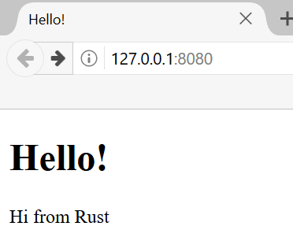

# Final Project: Building a Multithreaded Web Server

Yeh ek lamba safar raha hai, lekin ab hum book ke aakhir tak pohanch gaye hain. Is
chapter mein, hum kuch aur concepts ko demonstrate karne ke liye jo humne final
chapters mein cover kiye hain, ek aur project mil kar build karenge, aur saath
hi kuch pehle ke lessons ko recap karenge.

Apne final project ke liye, hum ek aisa web server banayenge jo “Hello!” kehta
hai aur web browser mein Figure 21-1 ki tarah nazar aata hai.

Web server build karne ke liye hamara plan yeh hai:

1. TCP aur HTTP ke bare mein thora seekhna.
2. Ek socket par TCP connections ke liye listen karna.
3. Chhoti tadaad mein HTTP requests ko parse karna.
4. Ek proper HTTP response create karna.
5. Thread pool ke saath apne server ka throughput improve karna.

Figure 21-1: Hamara final shared project

Shuru karne se pehle, humein do details ka zikr karna chahiye. Pehli baat, jo
method hum use karenge woh Rust ke saath web server build karne ka best tareeqa
nahi hoga. Community members ne [crates.io](https://crates.io/) par production-ready
kai crates publish kiye hain jo humare banaye hue web server aur thread pool
implementations se zyada complete implementations provide karte hain. Lekin,
is chapter mein hamara maqsad aapko seekhne mein madad dena hai, easy route
lena nahi. Kyun ke Rust ek systems programming language hai, hum abstraction
ki woh level choose kar sakte hain jis ke saath hum kaam karna chahte hain aur
doosri languages mein jo possible ya practical hai us se bhi lower level par
ja sakte hain.

Doosri baat, hum yahan async aur await use nahi karenge. Thread pool build karna
apne aap mein kaafi bada challenge hai, aur is mein async runtime build karna
add karne se challenge aur barh jayega! Haan, hum note karenge ke async aur
await unhi mein se kuch problems par kaise applicable ho sakte hain jo hum is
chapter mein dekhenge. Aakhir mein, jaisa ke humne Chapter 17 mein pehle note
kiya tha, bohat se async runtimes apne work ko manage karne ke liye thread
pools use karte hain.

Is liye hum basic HTTP server aur thread pool ko manually likhenge taake aap
un crates ke peeche maujood general ideas aur techniques seekh saken jinhein
aap future mein use kar sakte hain.
